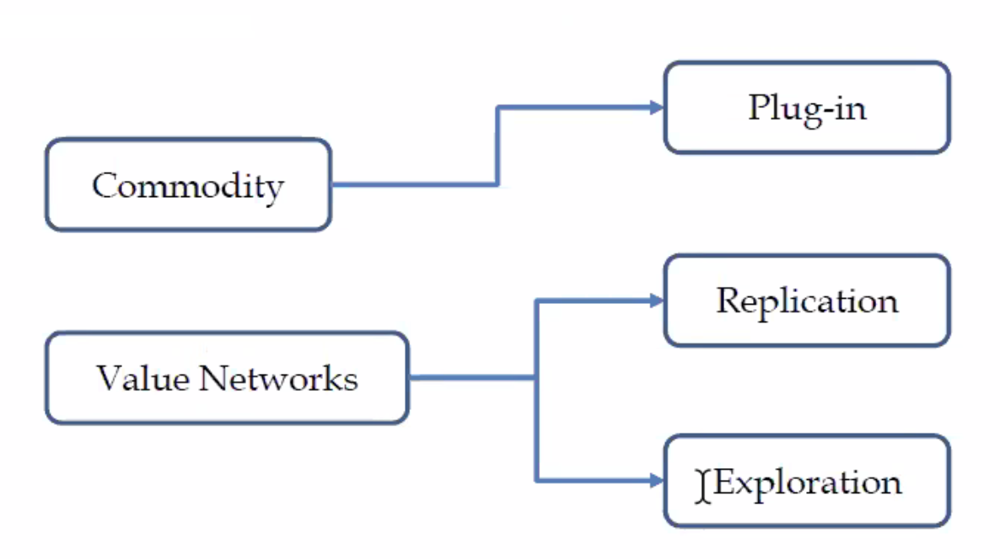

# 벤처창업론  

## 첫 수업  

### 창업은 경영이 아니다.  
- 많은 곳이 창업 교육을 한다면서 경영 교육을 하고 있다. 재무, 회계, 인사 등의 경영학적 지식은 창업을 하고, 운영하는데 도움은 되지만 그 자체로는 창업이 아니다.
- 그렇다면 창업학에서는 무엇을 배워야 하는가? 다음 수업에서 다뤄보도록 하겠다.
- 우선은 창업은 경영이 아니라는 것은 인지하자.

### 창업 부등식

배종훈 교수님의 이론에 따르면 창업은 다음 3가지로 구분할 수 있다.

- plug-in  
  높은 기술력을 바탕으로 창업. 주로 공학적 지식이 필요함. 예를 들면 추천 알고리즘이나 세그웨이와 같은 기술들.

- replication  
말 그대로 다른 기업을 복제한, 벤치마킹이다. 대개의 창업이 이 분야에 속한다.

- Exploration  
  배종훈 교수님의 말에 따르면 국내에서 거의 존재하지 않는 기업 형태로, 최근 교수님이 밀고 있는 창업의 형태이다. 자세한 내용은 다음 수업에도 다루기로 한다.  