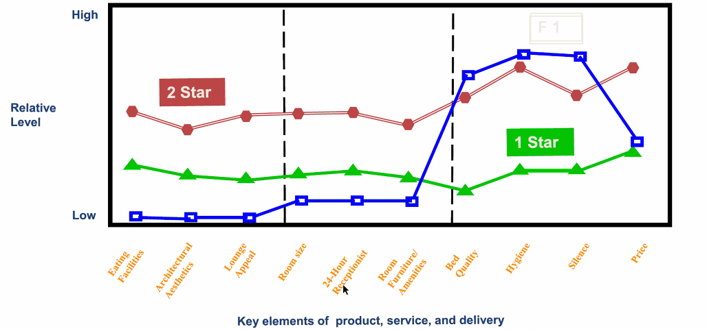

# 10번째 수업

## 마켓 모델

스타트업의 중요도는 `시장 > 상품 > 기술`이다.

시장(고객)이 제일 중요하고 그 다음에 상품이 중요하며 마지막으로 중요한 것이 기술이다.  
내가 기술자라서 기술을 종종 과대 평가하곤 하는데, 시장이 제일 중요함.

상품을 파는 기술은 "비즈니스 모델"(BM)인데
욕심을 내서 한 발자국 더 나아가면 "마켓 모델"이다. 여기까지 고민하는 스타트업은 적다.

판을 바꾸는 창업은 "우리가 장사하는 방식", "일하는 방식"을 바꿀 수 있는가에 대한 질문에 대답할 수 있어야 함.
일종의 "빅 퀘스쳔".

자율주행차와 보행자 간의 쌍방향 상호작용 연구 등 자동차를 생명체로 인식되도록 하는 기술

모빌리티 사업 => 기계 공학 + 도시 행정 + 법학
자율 주행 자동차가 도입이 당장 안되는 이유는 법적인 문제가 큼.
게다가 자율 주행 자동차가 다닐만한 도시 설계도 아님.
어쨌거나 모빌리티는 자동차 기술만의 문제가 아님.

자율 전기 자동차는 '차'가 아니라 '컴퓨터'이다. 애플이 왜 애플카를 만들려고 하는 건가.
자율 주행 차는 next 스마트폰이다.

앱스토어가 생산되어서 스마트폰 관련 어플리케이션이 활발하게 거래되는 것처럼, car software. 하드웨어를 UI로 시각적으로 표현 및 제어. 카 소프트웨어 구동을 위한 자체 OS 개발. 인프라 시장이 생성될 수 있음.

## 서비스 레벨 설계

린 스타트업.

기본 철학은 테스트임.

`가설 => 검증(MVP 개발, KPI 측정) => 학습`

피벗 : 비전을 바꾸지 않고 전략을 바꾸는 것. 이게 개념 정의임. 아이템을 그냥 바꾸는 건 엄격하게 봐선 피벗이 아님. 그러나 일상에선 아이템 전환도 피벗이라고 부르곤 함.

### 블루 오션 전략

블루 오션 이야기의 핵심은 경쟁자 없는 곳에서 1등하라는 말인데.

ERRC : new value curve를 만들어 내기 위한 4가지 방법론.
이 방법론의 핵심은 다 버리고 하나만 집중해서 업계 평균 이상으로 고객에게 제공하자는 거임.

Eliminate : 다 버리고 하나만 집중해라.
Reduce : Eliminate랑 같은 말임
Raise : 중요한 팩터 하나만 살려
Create : 딱 하나만 살려서 키우자.

왜 이렇게 할까? 스타트업 입장에선 자금과 생산능력이 부족하므로 모든 사항을 평균 이상으로할 수 없음.
딱 하나만 업계 평균 이상으로 고객에게 제공해야 함.

fomule 1이라는 호텔은 많은 것을 포기하고, 위생과 정숙을 챙겼다.
budget traveler들이 매우 많이 이용하게 됨. non-consumer(미충족 수요)를 만족시키게 됨.



결론적으론, non-consumer 가설을 세운 후에 잡다한 거 다 치워버리고 딱 하나만.

## 네트워크 관련해서

network (direct) externality : 그 물건을 쓰는 소비자가 많으면 신규 고객을 취득하기 쉬워짐. 어? 남이 쓰네? 나도 써봐야지

network indirect externality : 번들링 되는 상품이 있으면 같이 쓰게 됨. (보완재). 애플 생태계에서

### Profit Zone by Adrian Slywotzky

- profit multiplyer 모델

```
이 분야에서 사람이 쓴 책을 뛰어넘는 책이 없음.
이 책의 핵심은, 메인 사업에서 고객을 획득한 다음, 새끼 사업들을 침.
엔터 사업 분야가 대표적인데 연예 사업을 기반으로 연예 사업, 광고 사업 새끼를 침.
```

- product pyramid profit 모델

```
자기의 황금 어장을 지키기 위해서, 잠재적인 고객을 획득하려고 돈 안되는 사업 분야에도 진출해서 그럭저럭한 프로덕트를 만들어냄. 보통 대기업이 많이 하는 모델임.

벤츠는 E 클래스가 주력 상품인데, 훗날 더 비싼 자동차를 살 고객들을 감지하고 A 클래스도 내고 등등
```

- customer solutions profit 모델

```
물건을 팔고 솔루션에 추가 금액
현대차를 말고서 이를 할부로 사되 금융을 챙기는.
```

- time profit model = hit & run 모델

```
commodity market이라고 함.

1. 모방이 쉽다 && 2. 진입장벽이 없다 => 돈 벌 수 있는 시간이 매우 짧음.
   이런 경우 돈 잘 벌려면 가장 핵심은 `빠른 생산 주기`가 중요함.
   zara 같은 경우임. 7~10일 후면 자신의 옷 디자인과 비슷한 짝퉁이 중국에서 나오는 것을 알고 있다.
   따라서 7~10일 내에 최대한 매출을 빨아야 한다. 그래서 자라는 `n일 후면 우리 제품 없습니다. 매주 새롭게 신제품이 나옵니다.` 이런 전략으로 나감. 카피 나올 때 쯤에 다른 곳으로 도망가는, 빠른 생상 주기를 돌리는 거임.
```

- blockbuster model

```
the law of large numbers in a world of randomness
영화 산업은 생산 비용보다 동등하게 혹은 더 많게 마케팅비용을 사용함
영화 만드는데 100억 들었으면 마케팅비용은 120억 쓴다.
그런데 영화의 퀄리티는 증명이 되지 않는다. 평론가가 재밌다고 해도 고객들이 재밌어할지는 사실 연관성이 별로 없다.
초기에 고객들의 반응이 핵심이다. 그런데 이 반응은 예측할 수 없어서 노출을 최대한 많이 시키는 방법밖에 없다.
따라서 마케팅 비용에 돈을 많이 쓸 수밖에 없다.
9번 삼진해도 1번만 홈런을 때리면 상관없다는 거다. 10번 영화 망해도 1번만 흥하면 됨.
근본적으로 '도박'임. 영화 성공할 때까지 존버하면서 버티는 업계라서 어쩔 수 없음
```

전의 성공적인 BM이 성장하다보면 빠르게 BM을 바꾸고 체질을 개선할 필요가 있음
우직하게 있다보면 망한다.

### 사업을 보호하기

특허권 => 기술 보호.
lead time => 기술력이 뛰어나면 타사의 신제품, 보완재(비슷한 것, 짝퉁)이 나와도 다음번 사이클의 제품을 빠르게 가져갈 수 있다면 생존 가능(fast follow). 현대차의 경우 중국 차보다 lead time이 1.5년이라고 하는데 이 기간 내에 신제품을 내기만 하면 보호가능.  
업계 비밀 => 특허로도 노출하기 싫은 경우 사업 비밀로.

The Importance of Complementary Assets

플랫폼 사업에서 타 보완재(짝퉁)와 싸울수 있는 방법은 first mover advantage임.
