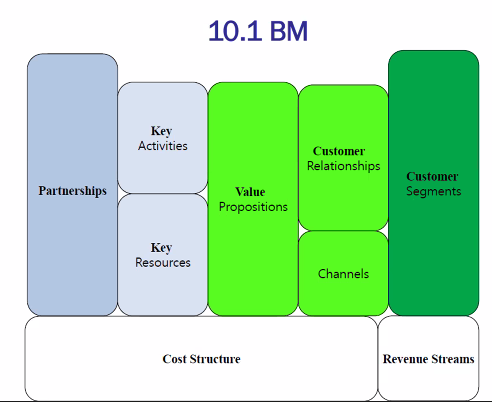
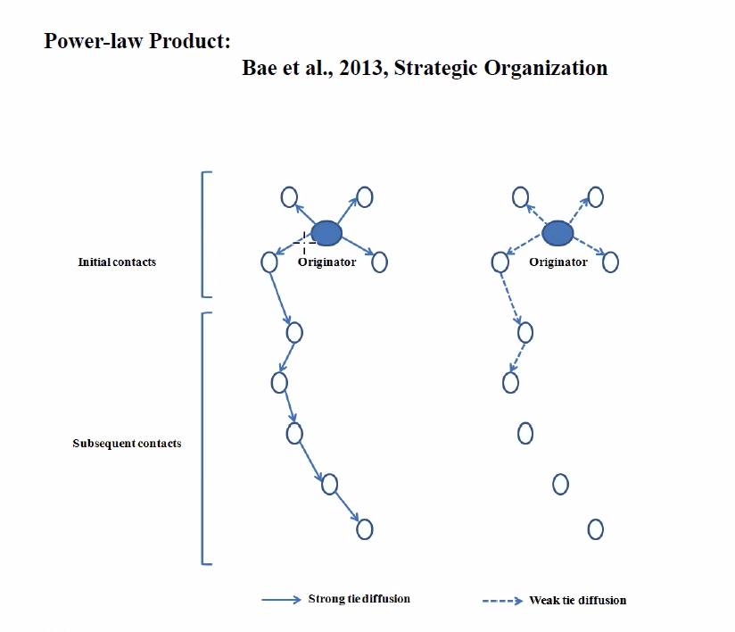

# 10번째 수업

## Customer Validation

### 수업 전 썰

scalability는 자처하고, 우선 해당 비즈니스 모델이 동작하는지가 중요. 초기에는 잊어버려라.  
one best solution을 가져오라는 것 딱 하나만. '좀 괜찮은 거 없나?'에 대한 대답.  
그리고 아주 작고 명확하게 정의된 곳에서 1등을 하고 명확하게 결과물을 가져오면 된다.

=> 내가 생각하기에, 우리 발표할 때도 매우 작은 시장을 먼저 타겟으로 하는 것이 중요할 듯.
하다 못해 '학생'이라는 고객으로 잡거나, '매우 극 초기의 스타트업'과 같은 류의 고객/시장 설정이 중요할 듯

**매해 이야기하는데 b2b 시장에 생산성, work process를 관리하는 아이템이 아주 클 것. productivity apps. 생산성 앱을 만들어봐**라는 교수의 말

### scalability

전 시간에 못했으니까 좀 이야기해보자.

외견 상으론 '규모를 얼마나, 어떻게 키울 것인가'에 대한 이야기.  
큰 물에서 놀고 싶으면 회사도 큰 물에서 놀고 싶은 기초 체력을 만들어놔야 함.

초기 스타트업에서는 경영학적 지식이 별로 필요하지 않음. 실행력과 아이디어 위주임.  
그런데 규모 확장 단계에 이르면 경영학적 지식이 필요해짐. 창업주는 경영학적 지식이 없는 경우가 대다수.  
큰 조직에서 경영을 해본 사람을 외부에서 수혈해야 함.  
즉, 초반의 스킬셋과 스케일링할 때의 스킬셋이 다르다는 것임.  
만약 좋은 VC라면 경영자를 추천해줄 것이다.

회사가 큰다는 것은, 그것을 감당할 수 있는 시스템이 구축되어 있다는 것임.

scalability는 '기업전략'이다. 다시 말하지만 '제품전략(기획, 마케팅)'과 '기업전략'은 매우 다른 것이다.  
기업 전략이란 회사의 덩치를 키우는 것을 말한다.

어떻게?

1. 내부 개발. bisuness development(10년뒤 먹거리 개발, 신수종 사업 개발)
2. M&A. 합병
3. alliance. 전략적 제휴

`기업 전략 = func(bisuness development, alliance, M&A)의 함수`이다.

이런 문제들이 성장하는 기업의 대표가 고민해야 하는 것이다.  
그러니, 초기 스타트업이 scability를 고민하고 기업 전략을 고민할 이유는 별로 없다...

지속 가능성. 강력한 도전자와 모방(Imitation Risks)으로부터 나를 지키면서 성장해야 함.

```
scabilabity의 두 과제
1. 미래 먹거리(기업 전략)
2. 모방의 위험으로부터 나를 보호하기
```

어떻게 나를 모방으로부터 보호할 것인가?

1.  첫 진출로 first mover의 장점을 이용하기 ex - hit and run, 기술력 고도화 등  
     특허권  
     진입 장벽(핀테크와 같은 법률적인 진입장벽이 있는 경우)
2.  리더십 => CEO의 역량. 이건 개인적이고, 매우 유니크한 부분이미 수업에서 다룰 수 없음.
3.  Efficient Design => operation과 관련된 것임. COO면 회사의 생산 시스템에 관여하는 사람임. 회사의 2인자임. 소프트웨어 개발자면 소프트웨어 개발에 관여. 제조업이면 생산 프로세스에 관여. 결론적으론, 생산 시스템을 효율적으로 구성하여 모방 기업보다 효율적인 운영하기

BM의 기본 가정 => 어떤 팩터가 수익성을 결정하는 건가? 내부의 생산 프로세스의 효율성.
마이클 포터의 5-forces 모델에 근거하여 스토리텔리을 할 수 있음.

사업의 (게임)의 법칙.

1. demand cycle => 아이스크림을 생각해보자. 그렇다면 demand cycle은 더울 때 팔렸다가 추울 때 안 팔림. 여러분이 상품을 파는데 해당 상품이 demand cycle이 있다면 고려해야 한다. 심지어 반도체도 demand cycle이 있음. 특히 선박 산업의 경우 demand cycle이 매우매우 길어서 선박 수요가 없을 때 버틸 수 있는 곳이 적음.

2. production cycle => 내가 제품을 만드는데 걸리는 시간! 신약, 바이오 산업을 생각해보자. production이 너무 길잖아. 10년은 더 걸리는. 그런데 요새 data와 정부 지원으로 productive cycle이 줄어들었음. 이걸 개선할수록 더 많이 벌 수 있음.

돈을 어떻게 버는가?(가치를 어떻게 창출하는가?) => demand(시장이 얼마나 크냐), scarcity(남들이 안하는 거 하고 있니? novelity), appropriability(benifit from something. 어디서부터 돈을 긁을 것이니? 곰이 재주부리고 돈은 광대가 가져가는 꼴이 존재할 수 있음. 내가 가치를 만들어냈으면 내가 돈을 가져가야 함.)

### BM의 기본 가정



진입 전략 및 진입 장벽  
비용 구조  
BEP 언제 달성할 거임? `공헌이익 = 매출액 - 변동비`이 플러스가 되어야 함  
리텐션. 재구매율이 얼마나 안정적인가?

### Customer validation(고객 테스트)

지금 시대에 데이터가 없어서 뭘 못하겠다는 건 변명이고, 지금은 찾으면 다 나온다.  
데이터가 너무 많으니 중요한 건, 이것이 좋은 데이터인가, 나쁜 데이터인가.  
GIGO(garbage in garbage out)이니까 잘못된 데이터를 기반으로 생각하면 쓰레기같은 결론이 나온다.

### 아이디어의 사업화

1. 화두 ... 현장에서의 디자인 사고/측정/공간/네트워크의 논리
2. 발견의 문제 ... non consumer(미충족 수요)를 찾아내기. zero to one
3. 페르소나 ... 우리 고객
4. 학습 ... 고객 테스트를 어떻게 할 것인가? A/B 테스팅
5. 사업모형 ... 현실적인 사업 모형.

## A/B 테스팅?

1. subject randomization  
   고객 데이터 자체가 편향적이면 의미 없는 테스팅이 됨.
   랜덤에 가장 좋은 방법은 특정 인터발마다 예를 들면 every 5 minuite마다 측정하는 것.

2. selectivy  
   올바른 성과 지표 필요.
   좋은 병원을 추려내기 위한 지표가 사망사 숫자가 적을 수록 생각한다면?
   중병, 응급 환자를 다룬 서울대병원은 안 좋은 병원인가? 성과 지표를 잘못 책정한 거임.
   그리고 base rate의 조건(어떤 환경) 정보 누락

3. over-representation
   투덜이 스머프. 적극적으로 불만 표출하는 고객이 좋은 고객임. 고객 베이스를 넓히고 우리 상품을 이해하기 위해서는 필요함.  
   그런데 테스트할 때는 목소리 큰 사람이 말하는대로 진행하다보면 삼천포로 빠짐.
   말 안하고 조용히 있는 사람들의 의견을 놓칠 수도 있음.

4. timestamp가 매우 매우 중요함. 정보 수집할 때 꼭 할 것.

5. non-response.

### 행복에 대한 지표 측정

행복은 추상적임. 매우 다양한 행복에 대한 정의 어떻게 데이터로 측정할 것인가?  
y = f(x)꼴, 지표를 측정해서 수치를 만들어내겠다는 건 맞긴 하지만, 학계적으로 분분하고, 수집이 매우 어려움.
hedonic(쾌락주의), non-hedonic(비쾌락주의)인 사람들의 차이도 있을터인데, 이런 지표가 인간 일반을 설명할 수 있을까?

어쨌거나 결론은

1. 가설을 명확히 밝히고 시작할 것. (x를 하면 y한 상태라고 가정하였음.)
2. 행동 데이터가 제일 좋음. 직접 물어보지 말것
3. 그러나 직접 물어보고 싶다면 3인칭을 쓸 것. '당신'이 아니라 '당신의 동료는', '철수는' 등
4. 서베이 결과를 신뢰하지 말 것. don't ask but observe.

###

The Initial contacts. 첫 고객은 스타트업에게 매우 중요하다.



대기업은 왼쪽 모델이다. 얼리어답터가 아닌 후발 주자들을 잡고 홍보한다.

반면 스타트업은 오른쪽 모델이다. 대기업과 다르게 첫번째 고객이 너무나 중요하다. 뒷단까지 홍보할 돈도 없을 뿐더러 적합한 전략도 아님.

스타트업이 들어갈 니치 시장은 '롱테일'전략임. 이는 '소비의 개성화'가 가능해지는데,
독특한 개성이나 소규모 수요를 충족시킬 수 있는 시장 세분화가 가능하고, 이는 대기업이 들어가기보다는 스타트업이 추구하기가 더 빠르고 효과적이라는 것! '꼬랑지'를 상대로 장사할 것.

크리스 앤더슨이 말하기를 온라인 시장은 "헤비 컨슈머", "파워 블로거"가 좌지우지 될 것이라고.
시장이 정규분포일지, 롱테일지는 모른다. 이를 고려하라.

influence maps 관해서 공부할 것

## 결론

기술 스타트업을 지향한다면 A/B test를 해라.
14주차에 발표도 하고...
