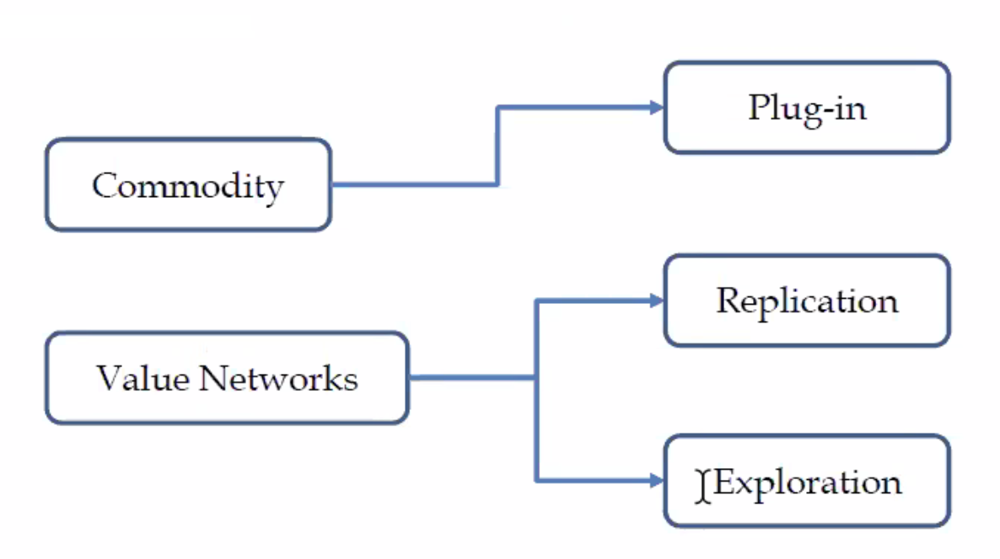

# 벤처창업론  

## 두번째 수업  

한 줄 요약 : 창업은 PS이며 이윤이 아니라 효율성을 찾는 문제이다.  

첫시간에 언급된 창업의 종류에 대해서 다시 짚어보자.

- Plug-in  
  높은 기술력을 바탕으로 창업. 주로 공학적 지식이 필요함. 예를 들면 추천 알고리즘이나 세그웨이와 같은 기술들.

- Replication  
    말 그대로 다른 기업을 복제한, 벤치마킹이다. 대개의 창업이 이 분야에 속한다.

- Exploration  
  value network을 만들어놓고 기다리면 폭발적인 성장이 가능하다는 것. 즉, 빠른 선제적인 투자와 규모 확장을 폭발적으로 세를 늘리는 방법  

## 기업가 정신의 요소   

기업가 정신의 구성 요소 2가지  

1. 전제 조건 : problem solving이다.
2. 제약 조건 : 단, PS의 제약 조건으로서  비즈니스가 성립해야 한다. => `효율성`

**이윤과 효율성은 매우 다른 것이다!**

먼저, PS에 대하여,  
인기 있는 문제를 푸는 것,
내가 좋아하는 문제를 푸는 것

`가치` : 문제를 풀면 가치가 창출된다.

`실행력` : 효율성이란 제약 조건 아래에 문제를 풀어나가는 능력을 말함.

`문제 해결력` : 아이디어는 이미 시장에 넘처 흐름. 그러나 좋은 팀은 없음. 사람을 모으는 것이 제일 힘듦.

`파괴적 혁신에 대한 오해` : 본래 의미는 low end disruption이다. 많은 기술과 인력, 비용이 들어가는 문제를 간단한 아이디어로 해결할 수 있다는 것임. 뛰어난 기술으로 해결하는 high end disruption는 파괴적 혁신이 아니다. 오히려 이 경우는 '혁신'이라는 용어가 적합다.  

다음, 제약 조건으로서의 비즈니스  
먼저, `비즈니스`가 성립할 수 있는, 납득 가능한 존재는 무엇인가?  
비즈니스적으로 납득할 수 있다는 것의 지표? => `효율성`  
아이디어가 좋아도 효율성이 좋지 않다면 비즈니스적으로 성립할 수 없다.  

해당 문제의 임팩트가 얼마나 큰다.
사이즈가 커질 수록 유지가 되어야 된다.  

PS를 평가하는 지표
임팩트가 있는 문제인가
불확실성이 있는 문제인가, 아닌가  

불확실성을 감수하고 PS에 도전하는 사람  

## PS에 대해서  

아이템 기반 접근이 아니라 문제 기반 접근을 해야 한다.  

문제 해결을 통해서 가치는 자연스레 도출되기 나름이고, 이러한 가치는 적든 크든 사회에 영향을 미치게 된다. 이러한 점에서 사회적  

## 사회적 경험  

input side의 정의  
어떤 용역 공여자가 누구냐. 장애인에게 일자리를 만들어내는 등, 투입되는 리소스가 사회적인 경우

output side의 정의  
아웃풋이 사회적인 문제를 해결하는 경우

## 사회적 기업과 일반 기업의 차이?  

의사 결정 과정이 다르다.  
PS가 창업이라고 한다면, 문제는 다음 두 상태로 말할 수 있다.  

- 남이 풀지 못한 문제, => non imitative entry (기회포착형 창업) => 시장이 아직 풀지 못한 문제(시장의 실패) => 사업 기회가 있다. => the creation of the market. 시장을 만들어야 한다!  
  
- 남이 이미 푼 문제 => 모방형 진입, 생계형 창업

사회적 창업과 일반 창업은 궁극적으로는 통합되어 있음... 
기업가가 사회적 문제를 풀지 못하면 사업이 성립하지 않는다. 모든 문제는 소셜적인 문제이다.
(너무 먼 이야긴데)

### 그 외의 여러 내용들  

- Eating your own dog food  
Dogfooding 은 자사 제품이나 서비스를 직원들이 일상적으로 사용하고 제품의 문제점을 확인하는 것을 말하는 것으로 사용자 관점에서 제품의 품질과 UX를 확인하는 것. [출처](http://www.opennaru.com/techie-talk/dogfooding/http://www.opennaru.com/techie-talk/dogfooding/)

- 학자, 슘페터와  

슘페터는 시기에 따라 이론이 달라지는데, 시험에 나오니 알아두자.

- Schumpeterian Mark 1 (청년기)  
자본주의의 핵심은 창업가다. 기업가가 세상을 바꾼다. 리스크 테이킹을 하는 사업가. 외로운 사업가 형태. 

- Schumpeterian Mark 2 (노년기, 1940)  
자본주의의 핵심은 조직, 대기업이다. 대기업이 오히려 더 기업가적이다. 위와 같은 류의 창업가가 설 자리가 없다고 판단함.  

## entrepreneur의 모델(유형)    

- Invention(Schumpeterian Mark 1의 관점) => 실리콘 밸리의 성향
- Scalability(Schumpeterian Mark 2의 관점) => 보스턴의 성향
- Networks

invention의 경우 차고에서 창업하고, 에디슨 같은 유형의 외로운 천재 형 창업임. Schumpeterian Mark 1의 유형임.

scaslability의 유형은 대기업의 R&D Lab. 즉, 연구실에서 이루어지며 F. Bacons이 말하는 유형. annalee saxeniand의 regional advantage에서 언급된 유형임.  

networks는 최근에 등장한 창업의 유형임.  

Doriot Model, 조력자에 의한 창업. 맨땅에 헤딩은 힘드니 인큐베이터, 엑셀러레이터 등과 같은 Doriot 이름이 붙은 이유는 Georges Doriot라는 경영 학자(Insead 경영 대학원 설립)가 창업이 성공하기 위해서는 patient capital, 즉, 인내심 있는 자본이 필요하며 network와 경영 자문을 제공하는 자가 필요하다는 이론을 냄. 이에 기반한 것임. 결론적으로 창업은 협동, 팀의 영역이라는게 결론.  

## 그래서, 이번 수업에서 배운게 뭔데. 

창업의 본질  
전제 조건 => PS. 시장 만들기. Zero to One  
제약 조건 => 효율성. 비즈니스 성림

창업을 하는 법, 즉, 시장을 만드는 방법은 3가지가 있다.  
Schumpeterian Mark 1 => 개러지 창업, 실리콘 밸리  
Schumpeterian Mark 2 => 대기업 R&D  
Doriot Model => 인큐베이터 등의 창업 전문가 집단과의 네트워킹을 통한 창업  