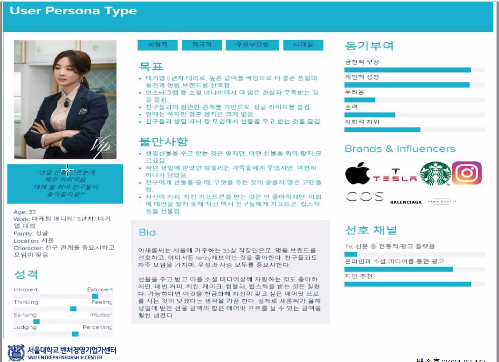
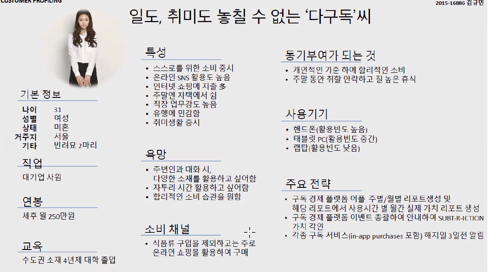
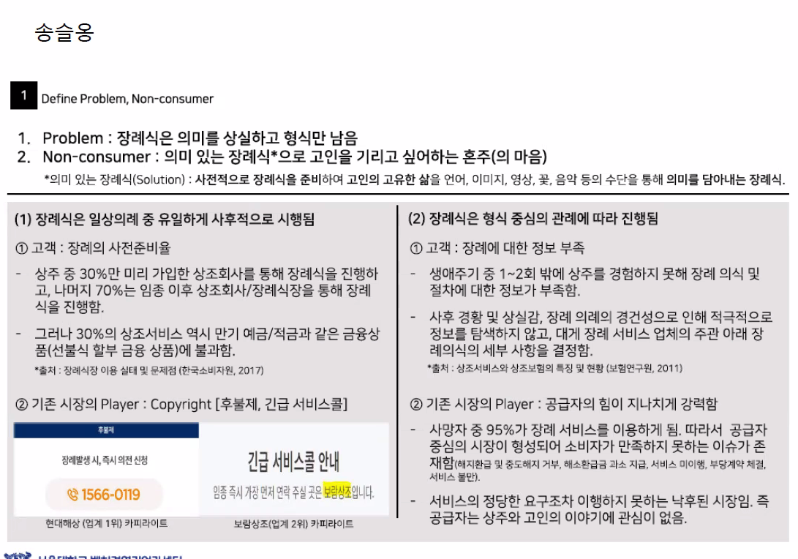

# 벤처창업론

## 네번째 수업

소비자의 언어를 액면 그대로 읽어서는 안된다. 바보도 아니고... 행간을 읽어야 한다. 어떻게? red associate에서 발간한 책인 `sensemaking`을 통해서 깊게 관찰하고 듣는다.

포커스 그룹, 기존 시장 분석에서 시작하지 않는다.

Ford이 만들어낸 소셜 밸류는 무엇인가?  
싼 가격으로 차를 공급하여 공장 노동자도 차를 소유할 수 있게 하자. => 기존의 장인 정신을 Fordism(Ford system)으로 치환 assembly line 기반의 기술 혁신

radical innovation은 지금 시장이 할 수 없는 것을 하는 것을 말한다. 들리기에는 `망상`으로 들린다. 지금 시장이 잘하는 거 들고 와봐야 red ocean이다. 뻔한 이야기를 들고 오지 말라.

`사업은 스마트폰 앱하나 만드는게 아니다 제발!`
단, 망상은 구현할 수 있는 현실 감각이 있는 시스템이 있어야 함.

New Market = New Category. 새로운 카테고리의 창출.

### Ethnographic Market Research = design thinking

질문하지 말고 관찰하라.

1. the moment of consumption (소비자의 소비 일상)
   나의 소비자의 하루 중 언제, 어디에서 내 제품/서비스가 놓여 질 것인가?

   제품과 서비스가 놓여진 시간과 공간에 대한 개념, 전략을 이어야 한다. 이것이 그 유명한 `Product Positioning`

2. big data도 좋지만 deep data from design thinking

big data는 평균적인 속성을 구하기 위해서 하는 것이 아니다. 평균적인 속성은 샘플 사이즈 1000명 정도면 알 수 있는 것이므로 big data가 필요하지 않다. '최적화 솔루션'이라는 말로 헛소리를 한다. 빅데이터의 목적은 최적화가 아니다.

진짜 big data는 segment-based solution, 즉, 특정 고객층에 대한 정보를 기반으로 personal solution을 내는 것이 목적이다. 이를 위해서 big data를 사용하는 것이다.

sensemaking도 똑같은 목적을 가지고 있다. 특정 고객층에 대한 정보를 알기 위해서 deep data를 사용하자는 것이다. 철학적으로 심오한 이야기를 하자는 것이 아니다. 매우 detail한 정보를 얻자는 것이다. 결국엔 `이익 공헌도가 높은 고객 세그먼트를 찾아야 한다.`

## Customer Profiling

매우 디테일한 고객 조사. customer definition을 해와라. 고객의 모든 것을 입체적으로. Don't ask but observe

일단 현장에서 해당 사건을 정확하게 포착하면 된다!
사진 존나 찍어 놓고, (혹은 묘사를 남겨놓고)
최소한 10개의 사용자 경험을 알아내면 된다.
정리할 때 다음과 같이 하면 된다.

## 결론

- Don't ask but observe  
  => 어설픈 통계치를 가져와서 설명하려고 하지 마라. 실제 현장에서의 deep data를 얻어와라.
- Don't explain but show  
  =>
