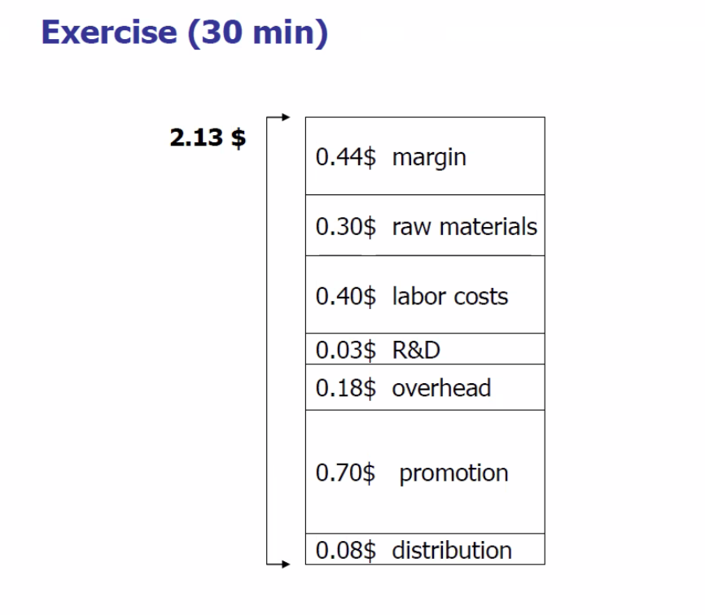

# 벤처창업론

## 여섯째 수업

### 그들은 무슨 문제를 풀려고 하려는 가?

Company X 란 녀석들이 있다. 구글의 Moonshot을 지향하는 프로젝트 팀이다.

뭐... big problem을 풀자는거다 결론적으론.

### 핀테크의 목적?

큰 문제가 2개다. `결제와 대출.`  
대출을 위해서는 보험(리스크 계산)과 같이 엮어 들어가야 한다.

### willingness to pay. 가격을 지불할 목적

how much would you pay this?

똑같은 맥주가 있다고 해보자.

A. 해운대 앞마다에서 파는 맥주  
B. 럭셔리 호텔에서 파는 맥주

어디에서 지갑을 잘 열 것 같음? 정답은 B임.

왜? 가격의 본질은 원가에서 나오지 않는다. 수요와 공급의 결과로 도출되는 것이 아니다~ 소비자가 가격을 결정한다.
Implicit Cognition(무의식적 영향)

### 자기(경영자, 창업주) 인건비를 잊지 마라

가장 바보 같은 계산은 원가에 비교해 마진은 몇% 가져가겠다는 것. 물론 시장 참여자나 관계자는 마진을 따진다. 그러나 가격을 결정하는 건 '소비자'이다.

예시를 들어, 아래와 같은 금액으로 커피 가격의 원가가 형성되어 있다고 해보자. 커피콩값 즉, raw materials만 들어가는 것이 아니다. overhead는 전기세, 공과금, 월세 등등. 원가충 아웃.  
distribution은 물류, 유통 비용. 매우 많은 비용이 발생한다.

여기에 추가적으로
경제학적인 관점에선 창업자들은 자기 인건비도 포함하여 제품의 가격을 책정해야 한다.

## pricing 수업의 요약.

1. 가격은 업체가 아니라 고객이 결정한다.
2. 재료값이 다가 아니다.
3. 인건비는 중요한데 바보 같은 경영자는 자기 인건비를 간과한다.
4. 원가구조 설계 = Business model 설계
