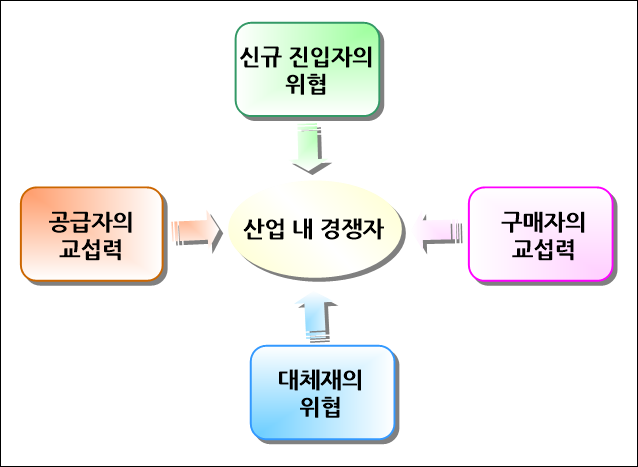
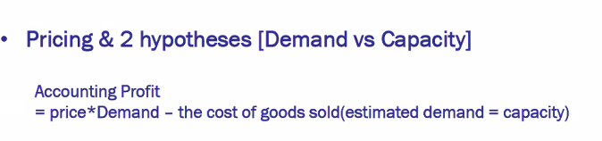
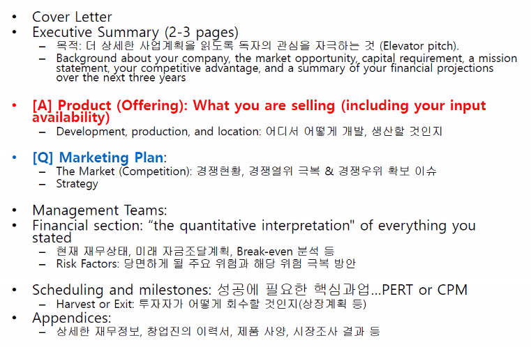

# 벤처창업론

## 일곱째 수업  

오늘 주제는 가격! 이다. 상품의 가격을 어떻게 책정할 것인가.  

## 일단 간단한 복습  

`문제가 잘 안 풀리면, 혹은 풀기 어려우면 문제를 재정의하라.`  
즉, `Problem redefinition`하라는 것이다.  

알려진 문제는 이미 풀렸거나, 다른 곳에서 잘 하고 있다.  
남의 게임을 하지 말 것...  

따라서, 아이템은 **새로워야** 한다.  
기존 솔루션을 개선한다면 10x solution을 가져오던가  
아니면 새로운 솔루션을 가져와라  

기존의 고객은 consumer이다. 고객 타겟이 무엇인지 제대로 확정이 된 사람이다. 회사 상장 보고서나 소비자 리포트 등에서 파악된다.  
물론 시장 조사를 하지 말라는 것이 아니다. 사업하려면 당연히 public information은 모조리 알아야 한다. 최소 요구 사항이다!  

그리고 기존 시장이 놓치고 있는 새로운 이야기들. 기성 시장에서 고객이라고 취급받지 않는 분야의 수요를 `non-consumer`라고 한다. (사람이 아니다!)
영어로 정의하면 `new demand that is neglected by the current market participant.`이다.   

이것들은 어떻게 알아내나? 현장에 가서 `design thinking`해야 한다.  

## 앞서 이야기한 것들을 좀 정리해보자.  

1. 가격 = 고객이 결정함. 수요와 공급이 아님.
2. 비용구조 = 사업자(나)가 결정함 = BM 결정하는 것.  

여기서, 나의 비용이 고객이 지불하는 가격보다 크다? 이건 사업이 클수록 손해를 본다는 것이다. 확장 불가능하다.  
=>  (1) 포기하거나 (2) BM 자체를 바꾸거나 (3) 뭔가 더 잘하려고 애쓴다.  

## 전략에 대해서

`기업전략(corporate strategy) vs 상품전략(=기획업무 =마케팅 비슷)`  

상품 전략은 많이들한다. 그런데 기업 전략은 잘 알려져 있지 않다.  
왜냐하면 기업 전략은 CEO가 하기 때문이다. 한국에선 오너가 혼자한다.  

어떤 상품 팔지, 포지셔닝할지는 상품전략, 기획이다. 이건 기업 전략이 아니다.  

그렇다면 기업 전략은 무엇인가? 앞서 말한 나의 비용 vs  고객의 가격에서 나의 비용을 낮추기 위한 기업의 방향성이다.  
`기업 전략 = func(organic growth, alliance, M&A)의 함수`이다.  

M&A는 금융이 아니다. 기업 전략이다.  

가격 -- 고객을 잘 알아야  
비용 -- 생산을 잘 알아야

## 고객이 지불한 가격과 나의 비용의 줄다리기  

마진률을 먼저 생각하지 말 것.  
가장 바보같은 가격 계산은 `가격 = 원가+ 사전에 결정된 마진율`이다.  
소비자 가격에 내가 맞춰서 들어가야 하는 것이다.  

비용 항목은 다 얽혀있다. 어느 하나를 줄이면 어느 하나가 올라가는 구조다.  

이미 쓴 돈인 sunk cost는 잊어버리고, 고정 비용(월세, 전기세 등)도 잊어버리고. `지금 이 순간, 물건을 하나 팔았을 때 들어오는 돈이 나가는 돈보다 많으면 된거다.` 이 규모를 확장해나가는 것이 스타트업.  

재무 용어로 하자면 지금 손해를 보더라도 변동 이익 증가폭이 더 크면 된다는 말이다.  

오프라인 매장을 열기 위한 가장 중요한 변수는 `땅(매장 위치)`과 `이용 시간`.  

## 사업자가 알고 있어야 하는 숫자들  

1. 전체 시장의 크기(total addressible market) : scalability(성장률)가 높은 시장이어야 함   

2. marginal analysis   

3. 가격 구조 : 마케팅 용어론 market segmentation, 학술적 용어론 demand heterogeneity라고 하는데, 시장이 경쟁이 정상적으로 이루어져 있다면 가격 구간이 여러개 나온다는 말은 고객 유형이 다양하다는 말이다. 만약 가격이 다 비슷하면? 이미 고정적인 소비자만이 존재하는 시장이라는 것.  

4. 시장 점유율 : 우리가 진출하면 시장의 몇 %를 먹어야 하는가? 25~33% 정도 사이즈가 합리적임.  

## 시장 분석의 기초  

몇 명의 플레이어가 있는지.  
플레이어들의 마켓 쉐어가 어느 정도인지.  
상품의 가격 레인지가 얼마나 되는지 => 가격 구간이 다양하다면 고객 유형이 다양하다는 것이므로, 특정 포인트를 잡아 진출함직함.  

같은 제품군에 여러 가격 구간이 존재한다는 것은 여러 고객 유형이 존재한다는 것인데, 가격 레인지를 통해 얻어낼 수 있는 전략을 실습해본 결과 다음과 같은 이야기들이 나왔다.  

삼성 스마트 워치의 최저가가 샤오미 스마트 워치의 최고가 제품 가격임.  
샤오미가 노리는 건, pleasant surprise.(가성비) 이 가격인데 이게 돼? 같은 놀람을 의도하는 것임. 그래도 물론 로우 퀄리티임.  

샤오미 상품군 내에서 고가 제품은 왜 팔리냐면, 가성비도 있지만 리텐션, 즉, 재구매하기 용이하다는 점. 가격이 싸니까. 황당무계하게 망가져도 다시 살 수 있고, 다른 제품을 그냥 재구매하기도 쉬움.  

더 나아가서, 중국 시장이라는 특수성이 상품의 비용을 낮춤. 사업자가 아무리 싸게 가격을 매겨도, 중국보다 쌀 수가 없으니 제조업하려는 친구들은 고려할 것.  

## Pricing & 5 Forces  

마이클 포터의 5-force 분석.
사업에 가해지는 5가지 압박 내지는 힘을 파악할 수 있다.  
제품 개발이나 신규 시장 진출, 신규 사업 착수와 관련된 케이스에서 유용함. 

- 산업내 경쟁자
  - 경쟁이 심화되면 수익률 낮아질 수밖에 없음. 제품 자체에 차별성도 없으면 원가 싸움으로 갈수밖에 없음.
- 신규 진입자
  - 산업에 진입 장벽이 없다면 경쟁이 곧 심화됨. 따라서 진입 장벽을 만드는데 노력할 것. 그것이 기술적 완성도이던, 독점 공급자를 마련하던 무엇이던...
- 대체제
  - 적은 비용으로 다른 서비스, 제품으로 갈아탈 수 있음.
- 공급자의 교섭력
  - 물건 팔려는데 원자재 공급하는 친구와의 교섭력. 
- 구매자의 교섭력
  - 만약 구매자가 소수라면 "우리 안 사" 하면 끝. 그리고 구매자들은 가격에 예민하기 때문에 함부로 가격을 올릴 수도 없음.

## Pricing & 3C  

3C = competitor, company, customer

competitor : 옆 가게는 뭐하고 있는지. 어떤 전략을 취하고 어떤 고객층을 대상으로 하는지 알아야 내 사업에 끼치는 영향이나, 내가 타겟으로 한 고객들을 뺏기지는 않을까 등 

## Pricing & 2 hypotheses  

  

**`phi = p*Q -c(Q^)`**

* phi는 이득, profit을 말함. 통상적으로 이윤을 의미하는 변수라 함.  
* p = 판매 단가(price)
* Q = 판매량 (quantity of goods sold)  
* c = 비용함수.  
* p*Q = 매출액 (판매 단ㄷ가에 판매량을 곱한 것이니)  
* 다시 말하지만 p(price)는 고객이 결정하는 것이고, 얼마나 살지도 고객이 결정하는 것이다. 고객이 이야기하는 것, demand side story 이다.  
* 반면 c는 supply side story이다.  
* Q^ = capacity. 실제 구매량이 아니라 미래 구매량에 기초해서 과거에 투자한 생산 능력을 말함. 일종의 리스크임. 예측하고 선행적으로 지출한 내지는 투자한 거니까. 이를 '캐파 결정'이라고 현장에선 말하곤 한다.  
* 캐파에는 종업원의 숫자도 포함됨. 캐파는 어느 정도로 팔릴지 예측하고 이에 해당하는 기타 비용들을 말하는 거니까. 이해하기 쉽게 예시를 들어보자. 제조업이라 치면, 캐파는 공장의 크기. 스타벅스의 캐파는 매장의 갯수, 종업원의 숫자와 근로 시간.  
* 초기 스타트업 입장에서는 Q^, 즉 캐파를 나 혼자 할 수 없다. 그래서 보통 외주, 위탁제조를 준다. 협력업체라고 하죠? 이거 구하기가 매우 어려움.  특히 스타트업이 제일 어려운 문제는 생산임. 어플리케이션을 만들던, 설계도 가지고 실제 생산을 하던... 

## 사업 계획서에 꼭 들어가야 하는 것?  

KISS
Number! 프로의 세계다. 숫자가 중요함.  

형식이 매우 중요하다.  
Cover Letter를 꼭 만들어라.  
아래의 형식으로 진행된다.  
  

사업 계획서의 핵심은 우리는 X를 하는 회사입니다. Y라는 문제를 해결할겁니다. 이게 핵심임  

재무쪽 설득의 핵심은 언제 break-even point에 도달할 것인지임.  
남의 돈을 받는 순간 여기에 도달하는 속도가 핵심임.  

발표 관련 내용  
  - CV 포함 제출 필수 
  - summary 포함해서 내기 
  - 사업계획서 형식,분량 상관없음  
  - 숫자로 소통하기 
  - 우리는 00 하는 회사입니다. 한줄로 이야기하고 시작하기 
  - Team capability 말하기 (창업경험, 업무역량, 코딩, 개발자 등) 
  - finance : 원가 / 마진 
  - 사업전략 & 마일스톤 
  - 자세한 내용은 appendix에 넣기

## 잡담  

제조업이 아직도 유효하고 매우 큰 범위다. 돈 만지는 애들은 제조업임.  

