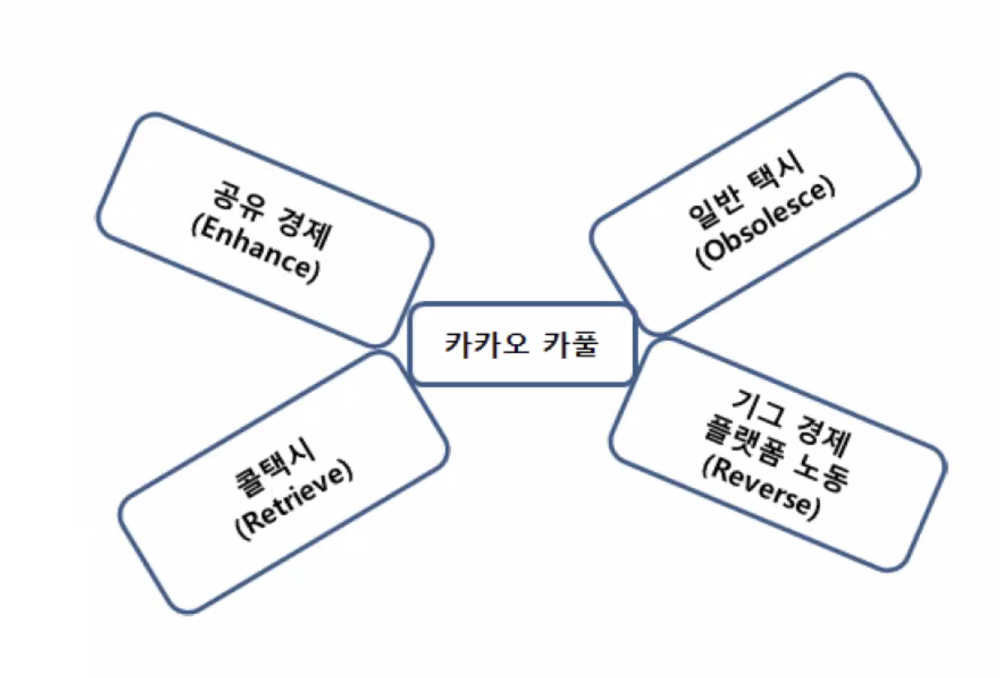

# 벤처창업론

## 여덟번째 수업

Sense-Making of Everyday Lives

### 다음주에 숙제?

어떤 아이템으로 최종 발표할 것인지. 비즈니스 플랜 이야기하기.

고객 정의 : 어떤 고객에게 팔 것인지. + 고객 프로파일링. 제발 누구를 target으로 하는 건지 알고 자신의 idea를 발표하라!

10분 동안 소개함. 양식은 마음대로.  
평가에 반영 안됨. 단순 피드백을 돌려주겠음.

- 새로운 시장을 찾고 검증하는 활동
- 현장에서 테스트하라
- 10명 이상의 use case 를 확보해야 한다. (최종에선)
- non consumer type 2까지는 나아가야 한다.

### Non consumer(미충족수요) discovery

비고객 1, 2, 3을 찾는 게 목적임.

미충족수요(non-consumer)를 찾아내는 과정.
지루하고 반복적인 탐색 활동이긴 함.
그래도 그것이 린 스타트업의 기본 정신임.

steve blank : "스타트업은 탐색을 위한 임시 조직이다" (무엇을 탐색? 고객을 탐색.)

### non consumer의 본질

type 1에서 type 3를 찾아가는 과정임.  
그렇다고 type 3를 한다고 해서 성공한다는 의미는 아니고, type 2, 3 정도로 올라가야 새로운 사업이 가능함.

- type 1(불만족스럽지만 소비 중) : 관찰 가능한 샘플. 당장 떠오르는 고객, 현재 시장 카테고리의 고객. 현재 서비스에 불만족하지만 어쨌거나 사용하는 고객들.
- type 2(불만족하고 소비도 안 함) : 확인 가능한 샘플. 거절당하고 있거나, 거절하고 있는 고객들. 현재 시장의 서비스를 알고 있으나 사용하지 않는 고객들. 이미 서비스를 사용해보았으나 불만족스러워서 이용을 안하고 있는 사람들. `잠재적 진입자`라고 부름.
- type 3(아예 모르는 사람들) : 관찰 불가능한 샘플. 현재 시장 카테고리를 모르고 있으며 새로운 시장 카테고리를 만드는데 기여할 고객. 지금 시장의 생산자들의 상품을 애시당초 모르고 있을 사람들임.

기성사업자들이 이해를 잘못하고 있는 세번째 유형의 고객을 설득하여 우리 사업의 생태계에 들어오게 하는 것이 좋다.

아이템이 정말로 새로운 것인가? = 새로운 고객을 데려왔는가? 고객 세그먼트도 명확하지 않은 경우가 많음.

type 1에서 type 3로 유저를 찾아가야 한다.

SM의 이수만이 케이팝 시장을 기획했을 때 non consumer의 타입을 찾아보자.

- non consumer type 1 (불만족스럽지만 소비 중): 해외 가수들의 스타일을 좋아하는데 국내에서 즐길 수 없던 음악 소비자들. 당시에 가요를 B급이라 생각하고, 팝송을 A급이라고 생각함.
- non consumer type 2(불만족하고 소비도 안 함) : 음악을 잘 소비하지 않던 초, 중, 고등학생들
- non consumer type 3(아예 모르는 사람들) : K-pop의 존재를 모르던 해외 고객들.

이수만은 궁극적으론 한국 가요를 미국, 일본, 중국에도 팔려고 시도했음. 현재는 type 2 + type 3를 묶어 처리하고 있는 상태임

Y-combinator의 top 100 most valued companies에서 나의 문제와 유사한 사업 선정,
그 회사가 찾아낸 non consumer가 누구였는지 서술할 것.

## 결론

non consumer의 type

- type 1(불만족스럽지만 소비 중)
- type 2(불만족하고 소비도 안 함)
- type 3(아예 모르는 사람들)

## non customer decovery

non customer 찾기에는 story based customer 발굴이 더 낫다.  
어떻게 하는건가?

1. 고객이 처해있는 상황을 알아내라. 내 물건, 서비스를 안 쓰는 상황이 무엇인지.
2. 사람들이 내 제품을 안 쓰는 이유는 이미 어떤 제품에 lock-in되었거나, 탐색하다 지친 경우가 많아서 그렇다.
3. 우리 물건, 서비스가 무엇을 하는 것인지 명확하지 않은가? 우리 제품이 줄 수 있는 효용을 소비자가 하나도 모르는 경우가 많음. 한 마디로 소비자는 침팬지라는 거임.

## 기성 제품을 분석하기

**기존 상품을 분석하는 6가지 툴으로 다음 것들이 존재함.**  
Purchase 구매  
Delivery 배달  
Use 사용  
Supplements 우리 서비스/회사를 다른 것과 섞어 쓰나? 추후 상품 보완 + 개발에 중요한 정보가 됨.  
Maintenance 유지 보수는 어떻게 하나? AS는 받나?  
Disposal

이 6가지도 유효하긴 한데 어느 정도 innovate한지 체크하는 방법

님 제품은 어떤 가치를 강화합니까?  
님 제품은 기존의 어떤 제품을 쓸모없는 것으로 만듭니까?  
님 제품은 어떤 것을 베끼고 있습니까?  
님 제품은 기존 지형, 판을 어떻게 바꾸고 있습니까?

[카카오택시를 예시로 들어보자.]

님 제품은 어떤 가치를 강화합니까? => 공유경제
님 제품은 기존의 어떤 제품을 쓸모없는 것으로 만듭니까? => 일반 택시  
님 제품은 어떤 것을 베끼고 있습니까? => 콜 택시  
님 제품은 기존 지형, 판을 어떻게 바꾸고 있습니까? => gig economy

## 오늘 수업

이미 있는 아이디어로 신제품을 설계하는데 만족하지 말고
숨겨진 수요를 찾아 새로운 기회를 발굴하라.

시장 = Demand = Price = 소비자가 정함  
고객 조사를 끝냈다는 것 = 가격 책정을 할 수 있다는 것.

## Sales Matter.

물건이든 서비스든 팔아야 사업할 수 있다.

1. 고객을 어떻게 찾을 것인가?. 시간과 장소로 정해라.
2. 그래서 얼마에 팔건데?
3. 잠재적 고객이 당신 물건을 사야하도록 어떻게 설득할 것인가?
4. 고객에게 서비스를 어떻게 전달할 것인가?
5. 첫 구매 후 재구매를 위한 사후 관리를 어떻게 할 것인가?
6. 어떻게 구매자를 충성 고객으로 만들고, 좋은 관계를 맺게할 것인가?

## tips

구매했는데 화난 고객과 아예 구매하지 않은 고객 둘 중 어느 구매했는데 화난 고객을 설득하는게 낫다. 비용적인 측면에서도 ㅇㅇ.
