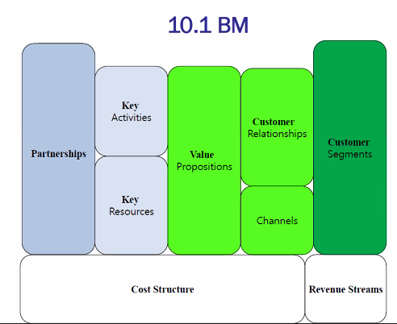

# 9번째 수업

## 잡담

2021년 1분기 핫 아이템
가계부 & fintech / 일정 조율(scheduling) / 협업툴 productivity apps

## 골목의 전쟁 책 읽고 이야기해 본 바

### **공간의 경제학**

'땅', '공간', '부동산'을 이해해야 한다.
이를 위해서 이해해야 할 내용은 다음과 같다.

1. 젠트리피케이션.  
   **플로우를 잘못타면 비싼 임대료 물면서 돈도 못 벎. 상권에도 사이클이 있음**
   상권 없던 곳에 다양한 소규모 가게 => 상권 형성 => 임대료 상승 => 임대로 상승을 견딜 수 있는 대형 프렌차이즈 입주 => 기존 가게는 임대료를 감당할 수 없어 이면도로나 골목길로 이주 =>이동.

2. Marshallian & Jacobian externality (마샬의 외부성/자콥의 외부성)

부동산 개발하는 사람이 중요시 함.  
마셜의 외부성, 자콥의 외부성.  
클러스터를 만들 때의 기본임. 혁신 클러스터. 산학협력단지.

마셜 => 비유적으로 말하자면 자동차 클러스터. 한 상품을 만들 수 있는 연관 업체들을 다 몰아 놓은 것. 자동차 바퀴, 자동차 차체 등 여러 업체가 자동차를 만들기 위해 다 몰려 있음.

자콥 => 비유적으로는 쇼핑몰. 상품의 다양성이 중요함. 다양한 걸 한 번에 여기서 다 경험할 수 있게끔. 소비자, 보행자 중 한 명만 걸려라!

상권을 개발할 때 마셜 외부성으로 개발할 건지, 자콥 외부성으로 개발할 건지 중요함.  
물론 이 입장은 정부, 큰 손이 하는 일이다.

**사업하는 입장에서는 이 외부성은 제약조건이다. '아, 이 상권은 마셜의 외부성이구나 / 자콥의 외부성이구나. 내가 들어가서 비벼볼만 하구나'를 판단하고 들어가야 함.**  
자영업은 힘듦 ㅋㅋ;

## 이제 비즈니스 모델에 대해서

사업은 PS다.
그리고 문제는 novelity와 해당 문제가 지닌 시장 잠재력이 중요하다.
그런데 비즈니스 모델은 '해결방법', 즉 솔루션이다. 이 솔루션이 현실성 있어야 함.
속된 말로 "장사가 성립하는가?".

비즈니스 모델 캔버스 좋은데 이걸 그대로 사업 계획서에 가져가는 사람은 없다.  
팀 내의 체크리스트처럼 사용하는거지, 사업 발표를 그렇게 하는 사람이 누가 있음?

### BMC 관련한 설명


Cost structure : 단가 계산. 상품 1당 들어가는 재료. => 원가, 재료비(거시 경제 필요), 유통비 등등.
Partnership : 협력업체. "시제품 어디서 만들거야". 공장을 운영할 수 없으니 생산업체 겸 협력사가 무조건 필요함. 기존 업체에서 스타트업은 nobody이다. 이런 애들한테 오더를 받으면 물건 생산을 안 해줌. nobody인 스타트업이 파트너를 어떻게 맺어야 할 것인가? 생산 업체는 "소품종 대량생산"을 좋아함. 근데 스타트업은 대개 "다품종 소량생산"임. 우리가 비비려면 단골이 없는 업체를 찾아야 함. 중소 업체의 판로를 열어야 함.
key activities : customer segment와 value proposition에 근거하여 작성.
key resources : customer segment와 value proposition에 근거하여 작성.
value proposition : 어떤 가치? 즉, 솔루션.
channel : 홍보 채널. 어떻게 접촉할거임?
customer segment : 고객이 누구야.

### value driver, cost driver, revenue driver

- value driver : 우리는 이런거 만드는 회사고 이런 고객이 타겟입니다. 이 시장 사이즈는 어떠합니다. 이거 돈 되는 시장이다.
- cost driver : 솔루션을 효율적으로 만들고 공급할 수 있니? 사업을 하려면 효율적으로 해야 함.

  ```
  효율성을 결정하는 요소 중 '생산 과정' = '일하는 절차'이다. magic eleven이라는 용어가 있는데, 11명이 넘어가면 업무 프로세스가 있어야 한다는 거다. 시간 배분, 대기 시간, 업무 분할 등. 사장은 이 상품과 기획의 의미와 정보를 넘겨줬는데, 11명이 넘어가면 이해 못하는 사람이 나온다. 정보가 sync되지 않는다는 것이다.
  이 지점이 원활하지 않으면 cost가 발생한다. 문제가 터졌는데 어디서 터졌는지도 모르고 집단의 효율 전체가 낮아진다.
  ```

- revenue driver : 그래서 돈은 어떻게 벌거니? 단순한 모델은 물건 팔면 얼마 마진 남는다는 식임. 이 부분은 '돈의 흐름에 대한 관리'와 '누가 나에게 돈을 내는가'에 대한 것임. 일단 대표는 현금흐름을 읽을 줄 알아야 함.

  ```
  가격, 생산, 현금은 CEO가 매일매일 체크해야 하는 것이다.
  우리 제품의 가격. 제품을 생산하는데 드는 비용, 우리가 지금 가지고 있는 현금.
  ```

  현금 흐름 관리에서 중요한 건 '투자는 언제쯤 받을까?'를 말함. 시드 투자는 뭐 그냥 받아도 되긴하는데 시리즈 A 정도 레벨을 이야기 하는 거다.

  ```
  일단 투자 안 받는 대표도 있음. 자기 사업의 페이스를 자기가 통제하기 위해서임.
  시리즈 A부터는 남의 돈을 받으면 그 순간부터 폭발적인 성장세를 보여야 한다. 빠르게 확장해서 규모의 이익을 발현해야 한다.
  속된 말로 일을 크게 벌려야 한다.
  잠도 못 잠. 속도가 핵심이기 때문임. 빨리 시리즈 B까지 도달하는게 핵심임.
  그래서 투자자 입장에서는 학생/교수 싫음. 졸업하지 않은 학생을 싫어함. 왜? 사업에 전념하지 않으니까.
  ```

## 규모의 경제와 범위의 경제

원가 효율성 차원에서 배교수가 구별한 BM들
scale economies : 규모의 경제. 마샬 외부성과 관련. 덩치가 커질수록 가격이 싸짐  
scope economies : 범위의 경제. 자콥 외부성과 관련. 다양하게

### 규모의 경제

규모의 경제는 고정비의 비중, 변동비의 비중에 따라 그 효과가 달라짐.  
변동비는 생산이 증가함에 따라 들어가는 비용도 증가하는, 원재료 값을 말하고 고정비는 고정된 값. 직원 월급이나 월세를 말함.

만약에, 규모의 경제를 이루기 위해서 모였는데 변동비가 커지면 못한다.
사업을 유지하는데 고정비가 많고 모여서 변동비가 늘지 않으면 모여서 같이 하면 좋다.

- 내 생각 : 확장 가능하다는 것 => 규모 성장해가면서 변동비가 커지면 커질 수가 없다. 생산하면 생산할 수록 손해일테니 클 수가 없는거지.

회사에서 규모의 경제를 이루려면 수요가 많아야 함. 무조건 덩치가 커야 이길 수 있음.
단품 생산, 업종전문화를 기반으로 사업을 시작하는 것이 좋음. 백종원이 말하는 솔루션이 이거임.

### 범위의 경제

시너지. pooling, bundling.  
생산 라인을 같이 공유하는 경우. 기본 자원들을 공유하는 경우 좋음.  
같은 동종 업체의 M&A는 규모의 경제가 아니라 범위의 경제가 대부분임.

### 5개의 BM을 소개해보겠다.

1. Focus 모델 : 규모의 경제. (위 참고) 대표적 기업 : 쿠팡

2. Integration 모델 : 범위의 경제. (위 참고) 원가 우위의 원천. 삼성

3. Coupling 모델 : 규모/범위의 경제가 섞여 있음. fous + integratoin = coupling.
   대표적 기업 : HP. 파는 건 프린터지만, 돈 버는 곳은 토너다. 2가지 이상 상품을 제공하고, 두 상품을 결합해서 고객 가치를 만듦. 한 제품에선 돈을 벌지 않고, 다른 제품에서 돈을 벎. 여기에 규모의 경제적인 장치가 하나 들어가야 사업이 됨. **돈이 되지 않는 상품은 원가 수준으로 가격을 책정해서 무조건 많이 팔리게 해야 함** 커플링 모델은 결합상품 설계가 핵심임. 당연히 돈 안되는 상품 쪽을 판매하는 관리자에게는 KPI를 판매량으로 하여야하고, 영업이익은 안됨.

4. crowding 모델 : 네크워크 외부성(Network externality) Network externality = Network direct externality (네트워크 외부성) 남들이 하면 나도 한다 = 다른 고객이 쓰면 비슷한 고객도 쓴다.
   맛집 입소문이랑 같은 거임. 친구가 맛있다고 하면 나도 가보잖아.
   고객 취득 비용에서의 이점이 있음. 비용이 안 들잖아.
   네트워크 외부성이 잘 발생하는 경우는 (1) 소비에 정보가 필요한 경우 (2) 전문적인 지식이 없어도 vibility가 높은 상품.
   crowding의 kpi는 무조건 마켓 쉐어임.

5. 플랫폼 모델 : 삼각형 비즈니스, 양면 시장(two sided market). 삼각형 비즈니스란 무엇이냐면, A-B 직거래에서 중개업자의 역할로 C가 끼어 들어 A-C-B의 구조가 됨. 그래서 삼각형임.
   `two sided market = f(resource producer, platform owner, consumer)`

이게 왜 장사가 되느냐?
(1) thin market(얇은 시장) = heterogeneity of seller & buyer. 뭔 말이냐면, 생산자도 다양하고 소비자도 다양해서 각 거래가 시장을 만들 수 없음. 대중적인 시장이 만들어지지 않음.  
(2) search cost = 탐색 비용이 클 때.

플랫폼의 종류?
(1) platform leadership : 플랫폼의 기술력이 중요한 곳. slack 같은 곳.
(2) catalyst : 기술력이 딱히 중요하지 않은 곳. 결혼중개업체 duo. 여기는 고객의 신뢰가 중요함. 바이어 입장에서는 내가 파는 물건을 베껴서 또 팔지 않아야 함. 중개만 해야 함. 자칫하면 생태계 자체가 죽음.

플랫폼 공통의 이슈
(1) 누구에게 돈을 받아야 하나. 셀러한테? 바이어한테? 답은 없다. 각을 잘 봐야.  
(2) 플랫폼 오너는 자기 상품을 팔면 안된다.

++ 블록체인 기반 스마트 컨트랙트와 곁들여 생각해보라는 교수님의 말씀.
++ 시장 설계의 핵심은 협력자 설계가 중요. 스타트업은 다 못함. nobody.
