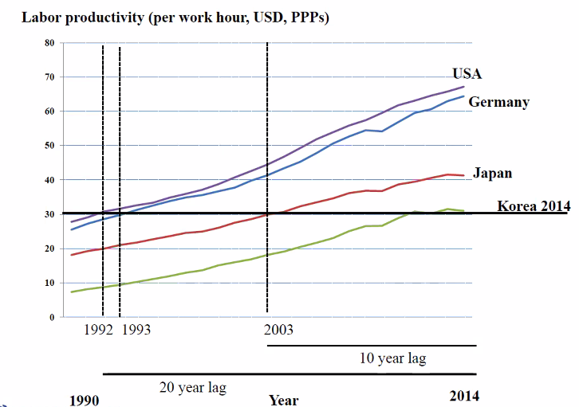

# 수업 전체의 overview  

아이디어는 그 자체로는 사업이 아니다. 
execution이 중요하다. 

평가자의 입장에서 아이디어를 성공적으로 사업화했다는 지표는 `가격`이다.  
쉽게 말해 `아이디어에 가격표를 붙이는 일`이 중요하다.  
자기 제품의 가격을 만들어낼 수 있어야 한다. 이것을 얼마에 판다는 것을 안다는 것이다.  
시장분석, 고객분석, 상품으로 만들어내면 어떤 가치를 만들어내는지를 전부 조사했다는 것이다.  

아이디어를 이야기할 때 가격을 이야기하지 않는다는 것은
1. 누구한테 팔 건지 모른다. (고객이 누군지 모른다.)  
2. 어떤 비즈니스 모델에서 굴러가는지 모른다.  
둘 다 모른다는 것이다.  

```
아이디어의 사업화 = (market) test + scalabilty  
```

test란 뭐다? => 누가 이 가격에 사겠구나라는 테스트 결과임. 여기에 Design thinking이니 뭐니해서 여러 고객과 시장을 분석하려는 것임.  
scalability => 초기 사업에서는 고려할 수 없지만 `기업 전략`의 측면에서 중요함. 또한 scalability issue들을 해결해야 함.  


## 사업의 명제  

생계형 창업 vs 기회포착형 창업  

우리는 생계형 창업에는 관심이 없다. 학과에서 관심있는 것은 기회포착형 창업이다.  
새로운 기회를 포착하고 만들어내서 변화를 이끌어내는 것.  

창업이 한 때의 유행은 아님. 우리 시대의 문제를 풀 수 있는 또 다른 방식임. 새로운 삶의 방식을 상상하고 만드는 것임.  
Excellence Without a Soul. 읽어보셈  

기술적으로는, 새로운 삶의 방식을 만드는 창업 방식으로 ERRC (쓸모 있는 거 하나 빼고 다 버려. 단 하나의 심플한 솔루션)  
highend 경쟁하는 애들도 마찬가지로, LG 냉장고와 삼성 냉장고의 차이가 그렇게 크기는 않음. 가격도 비슷함. 
이런 경우에는 기능은 비슷한데 가격이 싼 새 제품이 나오면 시장 다 먹어버림. 이런 건 막아야지.  

그래서 우리는 non-consumer를 찾고, 새 시장을 찾아야 한다.  

### non-consumer  

평범한 고객 분석은 도움이 되지 않는다. 우리는 non-consumer(미충족수요)를 찾아야 함. 새로운 시장을 찾아야 한다는 거.
zero to one이잖아. 

ANNALEE SAXENIAN <REGIONAL ADVANTAGE>에 따르면 미국의 혁신 심장이 2개가 있다고 함.  
실리콘 밸리와 보스턴.  
IT는 실리콘 밸리, 보스턴은 바이오 회사 있는 모더나와 화이자.  

창업 생태계는 실리콘 밸리 스타일과 보스턴 스타일이 존재함.  
보스턴 스타일은 대기업과 스타트업의 분업 형식임. 대기업 주도.
실리콘 밸리 스타일은 우리가 아는 그 시장.  

중간으로는 액셀러레이터를 대표로 한 지원 시스템. 실리콘 밸리/보스턴의 중간 형태.  
Doriot's Cooperation.

### 실행에 대해서

속도임. 용역 받지 말고. 속도 빠르게 만들고, 금액은 투자로 가급적.  
대기업은 서류 올리고 시간 오래 걸림. 그러나 스타트업은 무조건 속도로. MVP 만들고, 반응보고, 피벗하고 반복임.  
우선 만들어야 함. 지금은 제 1차 벤처 생태계와 달라졌고, 2차 벤처 생태계인 현재에선 속도가 최우선임. 
뭔가 빨리 만들어야 함.  

### big data말고 deep data(design thinking)  

사람, 시장을 읽는 것이 중요함. 
big data로 시장을 읽는데 도움이 되어야 의미가 있음.
너무 신뢰말고, 직접 현장에 나가서 deep data를 얻어내야 함.  
이게 design thinking를 통해서 데이터를 얻어내는 거지.

### app이 아니라 process가 중요하다.  

돈은 상품 그 자체가 아니라 상품을 만들어내는 프로세스에 있음.  
스마트 팩토리가 괜히 중요한 것이 아님.
잘 보면 한국은 미국이나 독일보다 생산성이 매우 낮다. 


결론적으로, 프로세스에 도움이 되는 b2b가 돈이 됨. 생산성 제품(생산성 툴)에 집중하라고 함.  

중소 기업은 프로세스를 객관적으로 보고, 관리, 개선할만한 능력이 없음.
슬랙, 잔디 이런거 필요함. 다시 말하지만 b2b가 키다. 

### 무턱대로 낮은 비용 전략, 프리미엄 전략은 위험함. 원가 따지는 것에 대한 중요성   

높은 비용 책정해서 프리미엄 전략을 하겠다 => 매우 나이브함. 프리미엄 서비스는 사람이 다인데. 비용이 기하급수적으로 올라감.  
낮은 비용 책정해서 낮은 비용 전략을 하겠다 => 프리미엄 전략만큼 나이브함. 매우 어려움.  

### 차별화  

새로운 카테고리를 만들어야 진정한 차별화
카테고리 내부에서 차이를 만들어내면, dissimilar clone임. 크게 성공하기 힘듦.  
그렇다면 어떻게 새로운 차별화 가치를 만들어 낼 것인가? 

Social problem to ask가 있는지 여부

### do you like sushi?  

미쯔다니라는 유명한 스시집이 있다.  
테이블 10개만 가지고 장사함. 분점도 안 냄. 그런데 유명함.  
왜? 주인장의 경영 철학은 이렇다.  

🧑‍🍳 주인. 스시집이 성공하려면 좋은 생선, 좋은 쌀집이 필요하다.  
🧐 기자. 협력업체를 한 곳을 계속 이용한다면 단골 할인이 있나?  
🧑‍🍳 주인. 없다. 오히려 더 비싸게 사온다. 왜냐하면, 좋은 상품이 들어오면 웃돈을 얹어서 다른 사람에게 못팔고, 내가 사오기 위해서임. 사업은 제 값을 주고 제대로 된 물건을 가져와야 함. 그래야 협력업체와 오래 간다.  

## 마지막 갬성 한 스푼  

창업은 돈 벌 기회가 아니라 PS이다.  
문제 해결을 위해서 시장을 창조. 
제품이 아니라 가치 사슬을 재설계하는 것임.  
Do you have problems to solve?  
