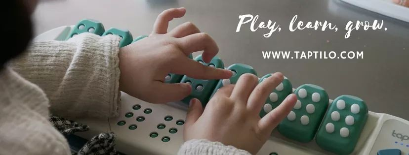

# 사회적 기업의 창업   

## 첫 수업  

### 강사 소개  
Impact Square라는 이름의 엑셀러레이팅 컴퍼니의 창업주인 도현명 대표. 2010년 창업하였음. 소셜 벤처를 위한 (1) 컨설팅, 연구, 평가 (2) 액셀러레이팅 (3) 인프라를 제공한다.  

### 소셜 벤처가 뭐야  

사업의 영역 중 사회적 갈등과 문제를 잘 해결하는 것으로써 뛰어난 비즈니스를 창출해낼 기회가 많아지고 있다. 이를 '소셜 벤처'라고 한다.  

예를 들어, 커피 찌꺼기로 만드는 숯(커피탄숯)을 만들면, 숯을 판매하는 것으로는 큰 이득을 얻기 어렵지만, 이러한 과정을 통해 얻은 탄소배출권을 판매하여 탄소배출권이 필요한 큰 기업에게 팔아 이득을 얻는 비즈니스 모델이 가능하다.  

또 다른 예시로, 전세계 시각 장애인 중 5%만이 점자를 읽을 수 있다는 문제가 있다. 이는 시각 장애인들에게 점자를 가르킬 수 있는 방법이 굉장히 한정적이고 구식적이기 때문이다. 이러한 문제를 해결하기 위한 점자 학습 기계인 '오파테크'를 개발하였고, 글로벌 시장에 진출하여 성공하였다.  

그 외의 예시들  

`수퍼빈`  

업사이클 컨셉의 `호텔 카푸치노` => 단순한 사호적 가치를 위해 소비하는 것이 아니라 색다른 경험을 주기 때문에 비즈니스가 가능함.
 
롯데케미칼의 `프로젝트 루프`  

### 강의 개요  
사회적 기업가에 대한 주목이 높아지고 있다. 사회 문제 해결에 대한 솔루션으로서의 사회적 기업은 현대사회에서 그 가치가 증명되고 있기 때문.

사회적 기업이라는 어떠한 형태와 정의 그 자체보다는 비즈니스를 통하여 사회 문제를 해결하는 것이 주요

1. 사회문제를 해결함으로서 비즈니스 기회를 창출하고 혁신을 이끄는 새로운 패러다임을 글로벌 시각에서 검토, 논의
2. 국내외 다양한 사회적 기업의 모델과 사례들을 학습하고 토의함으로써 사회적 기업가적 사고가 무엇인지 경험할 것
3. 팀 단위로 사회적 기업 아이디어를 모으고 이를 바탕으로 비즈니스 계획(bisuness plan) 개발하는 과정을 진행할 것

