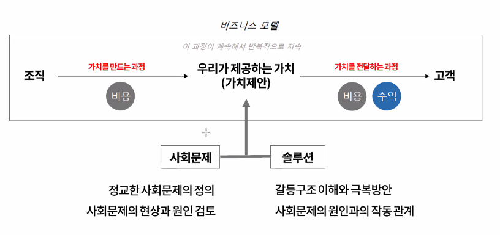
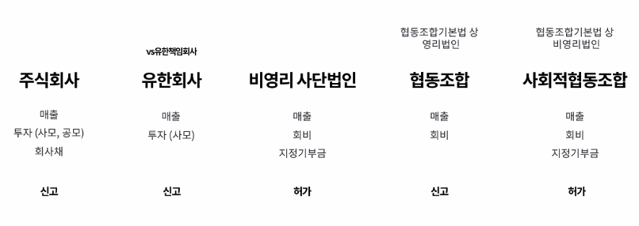
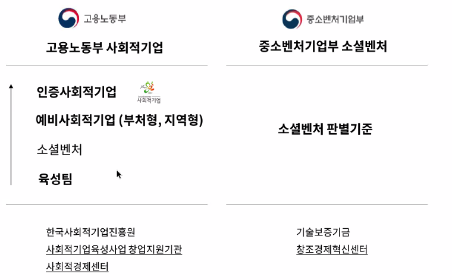
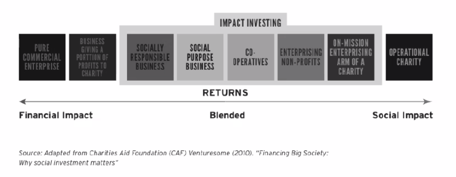
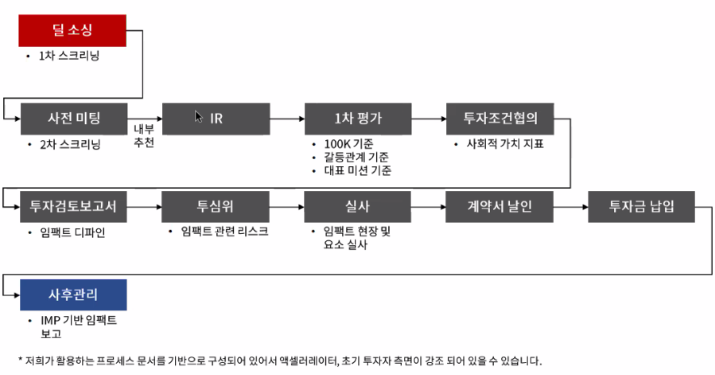
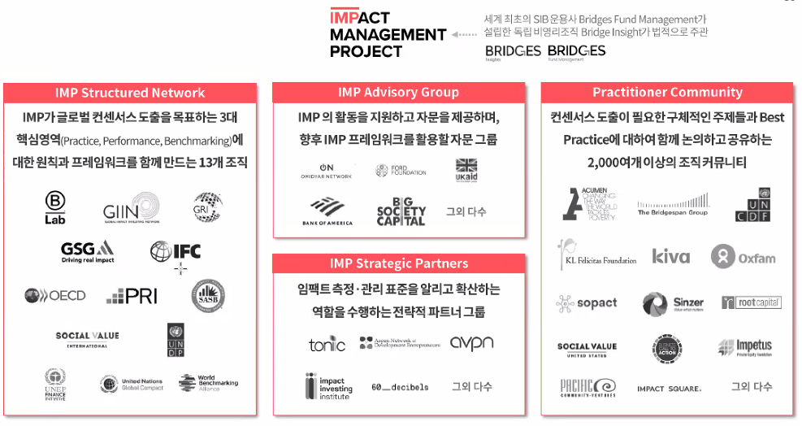
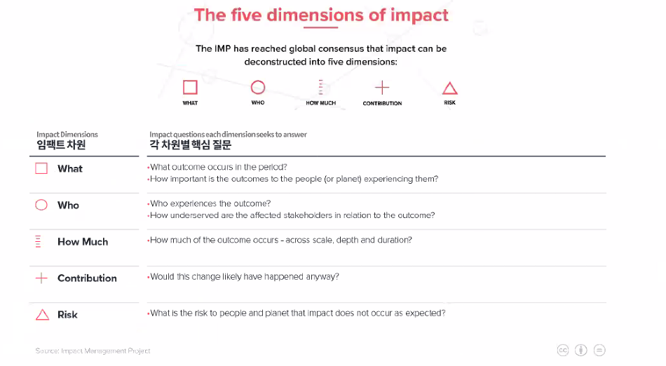

# 사회적 기업의 창업

## 세번째 수업

<세상을 바꾸는 대안기업가 80인>이란 책에 영향을 많이 받으셨다고. 사회적 경험의 성지는 샌프란시스코라던데, 이 분야가 계속 진행될 것이라는 판단을 하고, 학교에서 만난 도현명 대표와 낙성대에서 7평까지 공간을 얻어 창업을 시작했다 함.

### 사회적 기업과 일반 스타트업 사이에서의 창업 동기에 대한 오해.

일반 비즈니스는 돈, 성공에 대한 동기에서 시작하고, 사회적 기업은 이타심에 대한 동기에서 시작한다는 은연 중의 마인드 셋. 틀렸다.

사회적 기업가 정신은 일반 기업가 정신의 종류 중 하나일 뿐이고 가치 제안 자체가 다를 뿐이다.

사회적 기업가 정신은 착한 마음이 아니라 기업가 정신에서 출발한다. 사회적 기업가는 사회복지사가 아니다.

명확한 사회 문제, 사회적 가치의 정의에서 출발해야 함.

### 비즈니스 모델과 수익 모델을 혼동하지 말자.

단순하게 말하자면 수익 모델은 비즈니스 모델의 내부에 포함되는 것이다. 비즈니스 모델은

우리가 제공하는 가치가 무엇인가. 당연한 말이지만 사회문제와 솔루션을 결합해야 함.

### 팀 빌딩

비전에 대한 동의에만 그쳐 어려움을 겪는 경우가 많다. 팀원에 대한 역할이나 능력에 대한 의심, 모호함 등.

강사 개인적인 생각으론 너무 친한 가족이나 친구는 좋지 않다고. 친구의 친구 정도가 적당...

### 회사 설립

개인과 법인의 차이에 대해서 설명함.

법인 만들고 싶으면 등기국에 등기 올리면 된다.  
법인등기부등본(법인등록번호)가 생긴다. 개인으로 치면 주민등록등본  
개인 인감 = 법인 인감 증명서

사단과 재단의 차이에 대해 설명함.  
사람이 모이면 사단, 돈이 모이면 재단.

위 구분 기준에 따라서는,
비영리 법인도 영리 행위를 할 수 있다. 사업자만 내면 가능하다.

영리 사단 법인(대체로 주식회사)    
비영리 사단 법인  
영리 재단 법인 => 성립하지 않음. 왜?  
비영리 재단 법인

## 어떤 형태의 법인이 유리할지 고민해야 함

 
돈이 들어오는 방법에 대한 차이를 보고 결정해야 함.  
비영리 사단 법인, 비영리 재단 법인도 비영리지만 당연히 영리 사업을 할 수는 있으며, 지정기부금을 받을 수 있는 법인 형태이다. 지정기부금은 세법상 처리가 편함.  
반면 주식회사와 유한회사는 투자를 받는다. 기부금은 못 받는다. 돈 버는 회사니까. 단, 주식회사는 사모/공모가 가능하지만 유한회사는 사모 투자만 가능하다.

공시에 대한 의무가 없는 유한회사가 구글 코리아, 애플 코리아와 같은 곳이 편해서 자주 등록하는 법인 형태라고. 어쨌거나 주주회의도 없고 간편하고 페쇄적인 회사의 특성을 가지고 있어서 유한회사를 잘 이용한다고.

주식회사는 영리사단법인의 일종이며, 절차적 간편함과 자본확보의 편리함을 활용할 수 있습니다.  
주식 회사를 설립하겠다는 것은, 권리를 쪼개서 자본을 모으겠다는 의미.

자신이 100억 정도 있고, 지인들이 돈을 낼 것 같다면 유한회사로 해도 된다. 외부 투자가 필요 없고

설계한 비즈니스 모델이 주식회사에 맞는지, 유한회사에 맞는지, 비영리 사단 법인에 맞는지 고민하라.

### 사회적 기업 소셜 벤쳐만의 특이한 제도, '인증'

사회적기업 vs 사회적 기업
공백(' ') 하나의 차이일 뿐이지만, 인증을 받은 기업은 '사회적기업'으로 붙여쓰고, 대중적인 인식, 일반 용어는 '사회적 기업'으로 띄어쓴다. 의미적으로 좀 다르다.

고용노동부 입장에서의 사회적기업  
중소벤처기업부 입장에서의 소셜벤처

고용노동부의 인증을 받지 않은 사회적 가치를 추구하는 기업을 소셜벤처라고 부르다가, 소셜벤처를 지원하기 위해서 2018년 정부에서 중소벤처기업부에서 소셜벤처를 지원함.

### 투자, 임팩트 투자

투자는 기업 성공의 전제는 아니다.  
누구든 맡아서 할 수 있지만 자본 조달은 결국 그 책임과 의무는 대표의 몫임.

임팩트 투자란 무엇인가?  
사회적 가치를 중대하게 고려하는 투자의 일종

의도성,  
측정가능성:어느정도 영향력을 미쳤는지 측정 가능해야 함,  
재무수익성:투자니까,  
확장가능성:확장가능성이 높아야 함

이 투자를 집행하는 플레이어들 몇 개 들어보겠다.

임팩트 스퀘어  
https://www.impactsquare.com/

HGI  
http://www.hginitiative.com/index/investment

yellowdog (시리즈 B급을 투자함)  
http://www.yellowdog.kr/

### 임팩트 특정, 평가

사회적 가치를 측정하고 평가하는 이유는 소통하기 위한 정보, 관리를 위한 체계라는 차원.

사회적 가치와 이러한 가치를 추구하는 기업이 유발하는 영향력을 측정하기 위한 여러 지표, 측정 도구가 존재한다. 최소한 지표를 '보고'하기 위한 틀을 통일시키기 위해서 `Impact Management Project`가 출범. (줄여서 `IMP`)

https://impactmanagementproject.com/

### 사회적 가치의 아웃소싱화

`ESG` => Environmental(환경), Social(사회), Governance(지배구조) 이행 전략의 핵심 파트너로 사회적 기업, 소셜 벤처의 역할이 필요해짐.  

        미국 대통령으로 바이든이 취임하면서, ESG가 각광을 받고 있습니다. ESG는 환경(Environment), 사회(Social) 및 지배구조(Governance)의 약자로 기업이나 비즈니스에 대한 투자의 지속 가능성과 사회에 미치는 영향을 측정하는 세가지 지표입니다. 바이든 대통령이 취임 첫 업무로 ESG를 언급한 만큼, 이 중에 환경에 대한 관심과 투자가 늘어나고 있습니다. - 출처 : http://trendinsight.biz/archives/50858

탄소를 절감해!, 임원 중 여성 임원의 비중을 늘려! 하는 현실적인 압박이 들어온다면, 기업들은 기존 구조를 늘리기도 어렵고, 진행해본 분야가 아니기 때문에 사회적 가치를 추구하기 위한 팀, 위원회를 별도로 구성한다던가, 이윤 기업이 직접하기에 어려운 사회적 가치를 사회적 기업이나 소셜 벤처에 아우소싱하기 마련이다.

해당 기업이 직접 비용을 늘리기보다 사회적 가치를 추구하면서도 비즈니스 적으로도 유효한 소셜벤처와 대기업이 사업 연계 및 협력할 수밖에 없다는 것이 장기적인 결론이다.

paul hawkan의 </the ecology of commerce/>에 따르면, 현재 시장에 유통중인 상품의 가격이 인위적으로 하향 조작되었다는 의견을 낸다. 왜? 제품을 생산하는데 생기는 폐기물, 오염물 등 환경적 비용을 고려하지 않은 제품 가격이라는 것이라는 것임. 환경적 가치까지 제품의 가격에 반영한다면 전부 가격을 올려야 함. 이러한 외부불경제를 완화 및 내재화하기 위한 수단으로서 사회적 기업의 현실적인 필요성.
