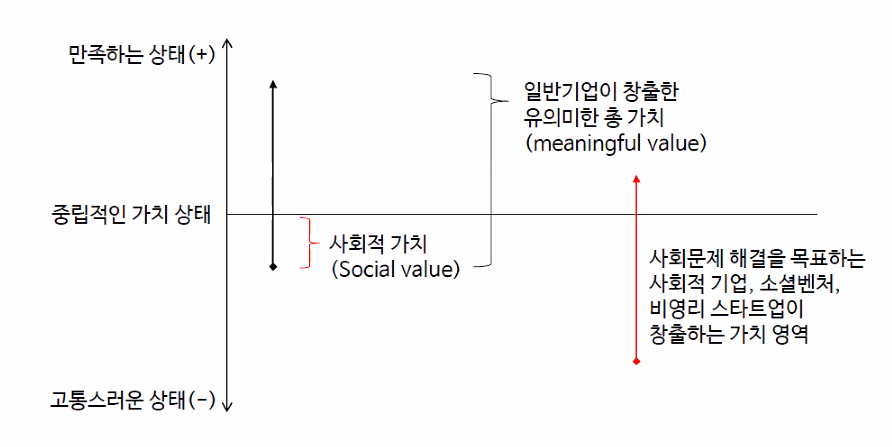
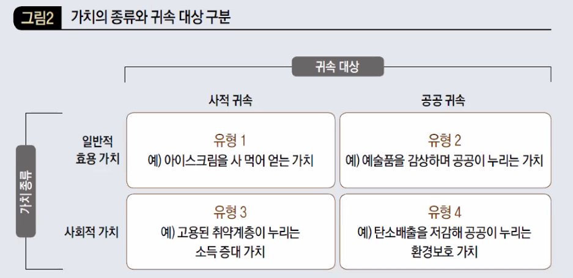

# 사회적 기업의 창업

## 네번째 수업  

### 사회문제란 무엇인가?  

어렴풋이 알고는 있는데 정의하기에 어렵다.  
우리가 겪는 혹은 모두 아는 문제가 사회문제인 것은 아니다.  
한국에서 빈곤과 AIDS, 여성 참정권은 사회문제가 아니다.  

사회적 기업은 소셜 임팩트의 크기로 결정되는 것도 아니다.  애플도 사회적 가치를 창출하지만 사회적 기업은 아니다. 물론 사회에 가져온 임팩트는 어떠한 사회적 기업보다 애플이 훨씬 클 것이다.  

사회 문제란, 구조적으로 현저하게 다수가 고통받고 있는 상태를 말하며 지역과 시대에 따라 달라질 수 있다. (지역성, 시대성)

사회 문제란, 

① 특정사회에 속하는  => 커뮤니티, 지역, 국가에 따라 다름  
② 구성원의 다수가 => 소수가 아니라 현저한 다수에게 인식되는 문제   
③ 구조적으로  => 문제 원인이 사회 구조적으로 발생하여 개인 노력으로 불가  
④ 고통받고 있는 상태  => 해결하지 못하면 참기 어려울 정도로 현저하게 불편한 상황  

사회적 가치란,  

사회적 문제가 해결된 크기를 말하며 일반적인 효용가치와는 구분됩니다. 

대부분의 사회적 문제는 3대 근본 문제로부터 출발하여 서로 간의 의존관계나 상호작용을 가집니다.  

  

### 소셜 미션  

사회적 기업에게 있어 가장 중요한 것. 사회적 가치 제안.  

### 갈등 관계  

사회적 기업이 사회적 가치를 창출하는 유형은 크게 4유형이 있다. 사회적 기업의 운영과 경제적 가치는 갈등관계에 있음  

①자선적 기부 : 경제적 가치를 희생해야 함. 사실상 쌩돈 나가는 것이니 경제적 가치와는 정 반대의 벡터.  
②운영적 고려 : 장애인 고용, 사내 종이컵은 머그컵으로 교환하는 등 운영적 측면에서 살짝 바꾸는 것. 자선적 기부보다는 경제적 가치를 덜 희생해야 하는 부분이다.  
③소싱이나 협력업체 : 예를 들면 공정무역이나 취약 계층 사업장과 연계하여 사회적 가치를 추구하는 방식. 공정 무역으로 커피 사오면 전제 조건은 착취를 안 한다는 것이므로 경제적 가치와 일부 상충됨.  
④제품이나 서비스 판매  : 저렴하게 보청기를 제공할 수 있도록 기술력으로 새로운 보청기를 만들었다. 경제적 가치와의 갈등 수준이 다른 것보다 낮은 편임.  

이러한 갈등 관계가 중요한 이유는 고객의 체감, 매출과의 연계 관점에서 확인합니다. 

`고객의 결정 즉시 사회적 가치를 체감할 수 있어야 한다. 즉각적으로 자신이 소셜 임팩트를 만들어냈다고 피드백을 주어야 한다`

①의 경우 **수익의 n%를 기부한다고 한다면, 자신의 소비 행위가 실제로 기부까지 가는지 의심하고, 실제로 임팩트를 주는지 의심하게 된다. 결과적으론 효.과.가. 없.다.**  

②의 경우 장애인을 고용했는지, 사내에서 머그컵을 사용하는지 마는지 고객은 알 턱이 없다.

③의 경우 애매하다. 

④는 경제적 가치와 갈등 관계가 적어서 열심히 이득을 내면 사회적 가치로 연결된다. 

성장하려는 소셜 벤처가 되려면 경제적 가치와 싸우면 안된다. ④이다!

