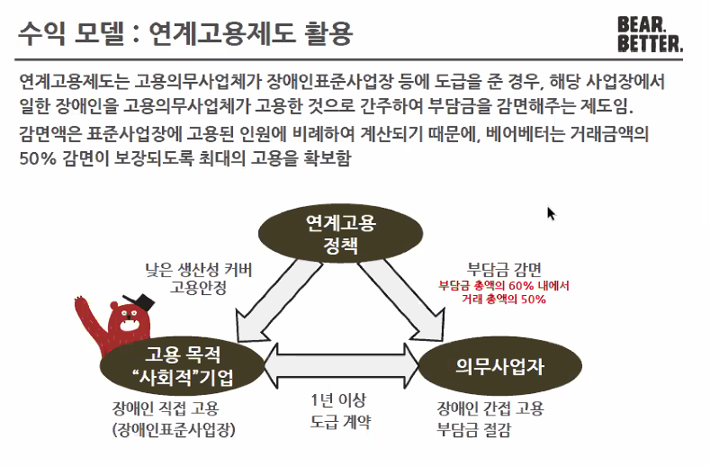
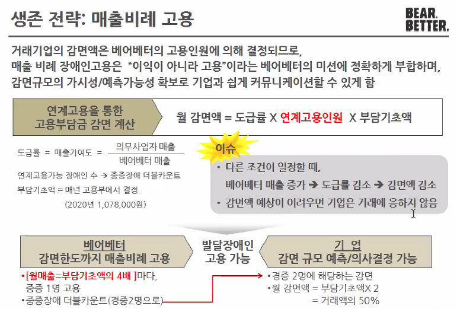
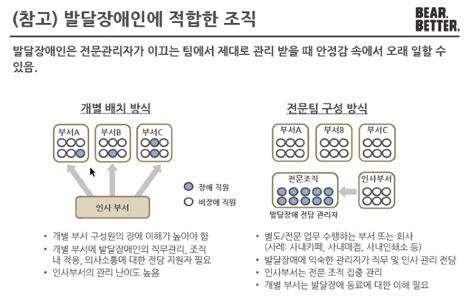
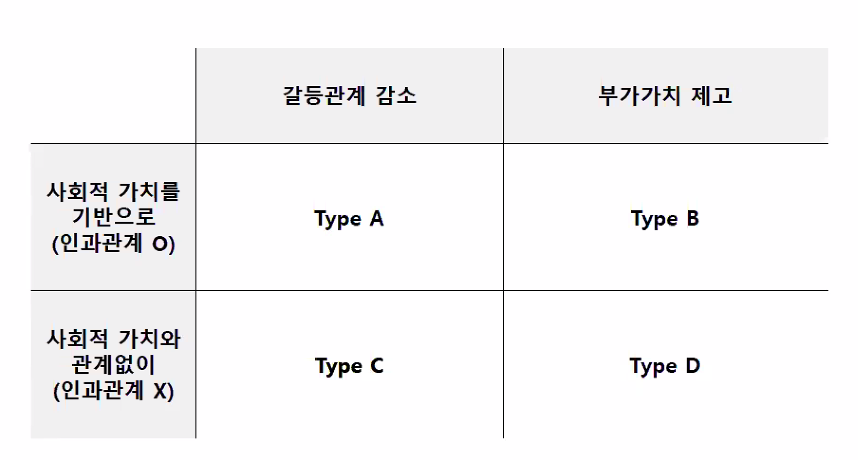
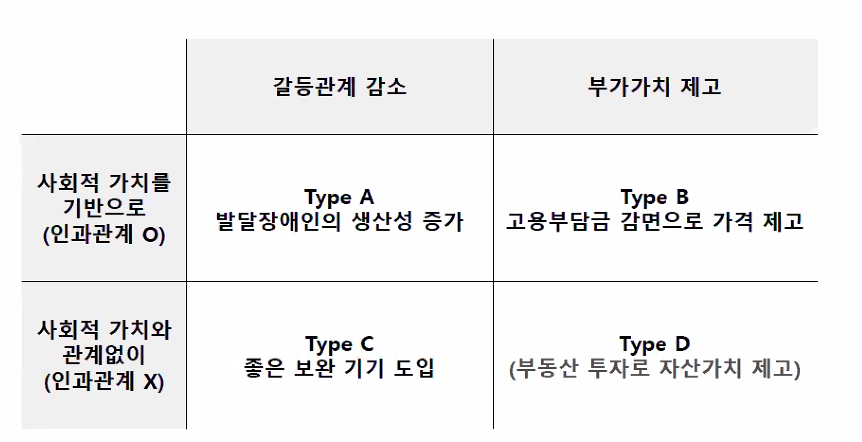

## 특강

베어베터. 저번에는 오파테크더니. 다른 회사 대표가 왔네. `발달장애인이 일하는 회사`라고 한다.

100명 이상 기업은 장애인을 의무 고용해야 하며 미고용시 고용 부담금 납부해야 함. 장애인의무고용제도에도 불구하고 중증장애의 고용은 여전히 어려움. 발달장애는 직무의 제한과 의사소통의 어려움으로 고용의 양/질 모두 낮음..

발달장애인의 일반고용을 위해
비장애인이 발달장애인에 맞추기
일을 발달장애인에게 맞추기

이런 회사가 어떻게 운영이 되고 있는가?

수익 모델은 연계고용제도임.
고용의무사업체가 장애인표준사업장 등 도급을 준 경우 해당 사업장에서 일한 장애인을 고용의무사업체가 고용한 것으로 간주하여 부담금을 감면해줌.

국가에서 주는 고용장려금을 통해서 당기 순익을 달성하긴 함. 영업이익은 계속 적자임. 심지어 해가 갈수록 심해지고 있음. 진짜 계산을 철저히 한다는 느낌임. 계산 실수가 곧바로 치명적인 손해로 이어짐.

선한 의도를 직접적으로 드러내지 않고 품질을 경쟁력으로 삼아 브랜드 이미지를 구축하려고 함. 장애인이니까 도와달라고는 ㄴㄴ해

사내 카페, 꽃배달, 명함 제작, 복사 등 B2B 기업의 수요가 있을만한 지점을 노림.

장애인의 수 자체는 나이가 낮아질수록 적어지는 국면임. 그러나 30대 이하의 장애인 중 70% 정도가 발달장애임. 의류 수준이 높아지면서 선천적인 장애는 발달장애가 대부분이 됨. 어쨌거나 장애인 중 발달장애가 많아지고 있다는거.

## 발달장애인과 일하기 위해서 회사를 어떻게 조직해야 하는가?

장애사원 관리자가 제일 중요함.
발달 장애인 고용 확대를 위해서는 기업 내 장애이해 관리자가 필요함.

수용성 : 돌발적인 문제 행동이 아닌 불편함/요구 표현의 시각으로 보아야 함.
민감성 : 간섭 지양. 존중하면서 환경 관찰.  
그 외에 규율 조성, 인내심이 필요함.

기존 부서에 전문가가 들어가 있는 방식은 난이도가 높다. 발달장애 전담을 별도로 하는 조직이 따로 있어야 한다. 이게 발달장애인이 오래 일할 수 있는 환경임.

그리고 직무를 쪼개서 단순하고 쉬운 업무를 할당해야 함. 카피업무를 한다고 한다면 코팅따로, 재단 따로 이렇게.

이렇게 특강은 끝.

## 사회적 가치와 경제적 이득의 갈등감소안

전 수업 중에서 다뤘던 것처럼.

사회적 기업이 사회적 가치를 창출하는 유형은 크게 4유형이 있다. 사회적 기업의 운영과 경제적 가치는 갈등관계에 있음

①자선적 기부 : 경제적 가치를 희생해야 함. 사실상 쌩돈 나가는 것이니 경제적 가치와는 정 반대의 벡터.  
②운영적 고려 : 장애인 고용, 사내 종이컵은 머그컵으로 교환하는 등 운영적 측면에서 살짝 바꾸는 것. 자선적 기부보다는 경제적 가치를 덜 희생해야 하는 부분이다.  
③소싱이나 협력업체 : 예를 들면 공정무역이나 취약 계층 사업장과 연계하여 사회적 가치를 추구하는 방식. 공정 무역으로 커피 사오면 전제 조건은 착취를 안 한다는 것이므로 경제적 가치와 일부 상충됨.  
④제품이나 서비스 판매 : 저렴하게 보청기를 제공할 수 있도록 기술력으로 새로운 보청기를 만들었다. 경제적 가치와의 갈등 수준이 다른 것보다 낮은 편임.

자, 그래서 뭐 어떻게?

갈등관계 감소 = 돈 버는데 방해되는 거 없애기 혹은 사업으로 돈 벌기  
부가가치 제고 = 외부에서 경제적인 이득 얻기

사회적 기업이 만들어내는 사회적 가치는 대체로 경제적 가치를 희생해야만 할 때가 많다.

type D는 우연에 의한 일일 가능성이 대다수.
업사이클링 공장을 차렸는데 해당 공장의 지역이 재개발되어서 땅값이 올랐다는. 우연임.

전략적으로는 A, B, C가 추구해볼만함.

스페셜리스테른이라는 소프트웨어 업체에서 발달장애인을 고용해 대성함. 쩌네요.  
https://platum.kr/archives/3423  
https://bizn.donga.com/3/all/20170613/84841397/2

제시카 알바라는 연예인의 인지도를 이용한 경우. 어니스트컴퍼니.  
https://www.asiae.co.kr/article/2019062716053265262

아라빈드안과병원. 기부모델인데도 성공시킴.  
무료로 시술을 받을 수도 있어서 사실상 기부 모델임.
맥도날드식 수술 방법. 유일하게 줄일 수 없었던 비용이 렌즈 가격임. 그래서 저가 인공 수정체를 만들어내는데 성공함. 신사업개척임.
https://m.blog.naver.com/bizwebkorea/220956275057

## 사회문제 해결 접근방법 사례 연구 - 공부의 신

지금은 사회적 기업에서 오조오억배 떨어졌지만
어쨌던 예전에는 좋은 대학 간 애들이 좋은 대학 가고 싶어하는 애들한테 팁을 영상으로 제공한다는 걸 비즈니스 모델로 했던 애들.
