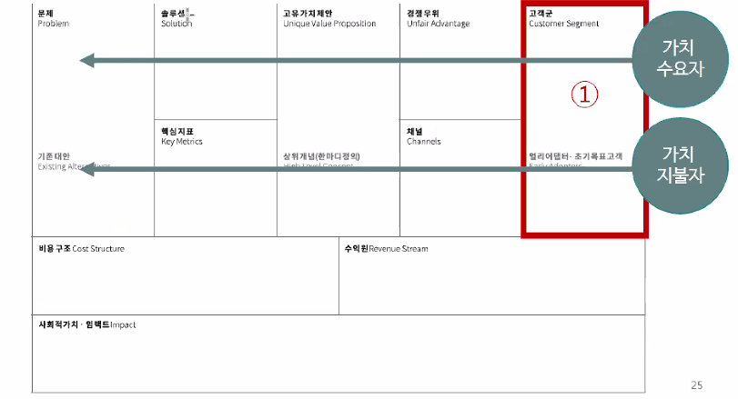

# 사회적 기업의 BM  

## 가치 수요자와 가치 지불자  

가치 수요자가 지불 능력이 없는 경우가 많다.
이래서 가치 수요자와 가치 지불자가 다른 하이브리드 형 BM을 설계하는 경우가 잦다.  
혜택을 볼 사람과 돈을 낼 사람이 다르다는 것이다.  

다르니까 BM도 양 쪽 모두 고려해야 한다.
양면 시장도 양 쪽 다 고객이듯, 가치 수요자와 가치 지불자 둘 다 고객이다. 

## 가치 수요자와 지불자가 동일한 경우  

예를 들어 micro finance. 그라민 은행. 그리고 그라민 은행이 진출한 그라민 푸드.  
이런 케이스의 경우에는 BOP(bottom of pyramid) 전략을 씀.
피라미드의 바닥에서 적은 가격으로 많은 제품/서비스의 수를 판매하여 수익을 얻는 경우임.  
다만 사회적 기업으로서 가격, 가치 측면에서의 Value Add가 필요함.  

## 대체 지불자?  

가치 수요자가 지불 능력이 없는데 정부에서 바우처 발급, 지원금 보조가 있는 경우 검토해보라.  

## 고객의 관성  

사업 시작에 앞서 명확한 고객 타겟과 욕구가 무엇인지 체크하기 위해서  
고객 페르소나를 만들고 인터뷰를 막 한다.  
그런데 이 와중에 잊고 있는 것이 있다.  

소비자가 선택을 할 때, **Gain/Pain Ratio**를 의사결정할 때 사용한다.  
"저걸 사면 얼마나 좋을까/이 정도 욕구는 참을만 하지"  
그런데 여기에 하나 더 추가해야 하는 것이 **Inertia**(관성)  
Switching costs(전환 비용)  
default = do nothing(기본적으로 아무 것도 안하는게 디폴트인 분야)  
alternative  
risk on startup  

