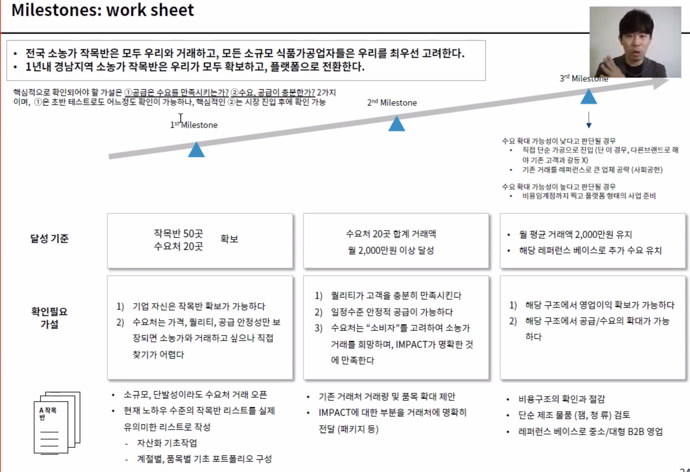

# 실행계획 / prototype

## BM 정리

사례 1) 차차프렌즈

10만 유튜버 + 팬.
피아노 전공생의 진로
웹으로 딱히 하지 않고 카카오톡으로 결과물 보내고, 카톡으로 지도해주는게 끝임.

사례 2) 코끼리 공장

어린이집 선생님
장난감이 남아 도는 아이들과 하나도 없는 아이들.
그리고 수없이 버려지는 장난감들.
사업 하다보니 소독용품이 빵 터졌음. 사업 하다보면 어디서 터질지 모름

사례 3) AI굿윌 => 피싱캣.

보이스피싱 예방에 대한 발상 전환. => 통화 중 의심행동이 발생(예를들어 심박수 증가하고, 통화 직후 금융 앱을 켠다던지 등)하면 피슁 의심.
시장 진입과 성장 방향

==

## 사업 계획

목적 : 궁극적인 goal.
목표 : KPI. 수치와 목표.

기획 : 방향 설계
계획 : 구체적인 일정. 마일스톤

일반적으로 목표, 과제 중심으로 계획을 짬.

잘못된 실행 계획의 예시
type 1) 1년 뒤에는 1억을 벌고, 2년 뒤에는 10억을 번다. goal only  
type 2) 이번 달에는 뭘하고, 다음 달에는 무엇을 할 거임. task only

"실행 계획"의 핵심은 스스로가 인식할 수 있는 가이드를 스스로 만드는 것입니다.
세스고딘의 <더 딥>. 일정 기간 동안 어떤 단계에 이르지 못하면 무언가 잘못되었다는 것을 스스로 알아야 함.

### 그렇다면 실행 계획은 구체적으로 어떻게 짜야 하는가?

장기 목표, 1~2년 내에 달성할 목표 설정 (시장 단위, 목표 시장 내의 어느 정도 마켓 쉐어를 가져갈 것인가.)  
단계의 구분과 기간 설정. (총 기간은 1년)  
단계별 달성 기준 설정
단계별 확인필요 가설 정리
단계별 key task 정리.

### 실제 실행 계획 예시들

1. 바테서. https://f2b.co.kr/

저소득, 소규모 영세 농가는 질은 좋아도 대형 업체에 납품하지 못하거나 질이 애매한 경우 있음.  
이런 사람들의 농작물을 자영업자가 식품 가공업품자와 연결해주는 플랫폼임.

고객 중심의 사업 설계에는 프로토타입이 가장 중요하게 다루어짐.  
고객이 좋아하느냐 안 좋아하느냐, 돈을 낼 의향이 있느냐를 체킹하는 거임.
