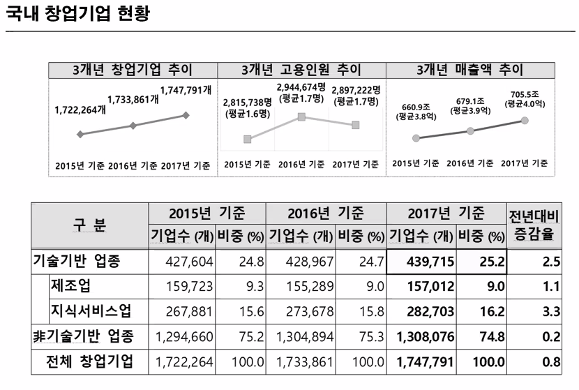
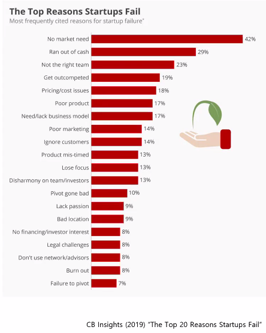
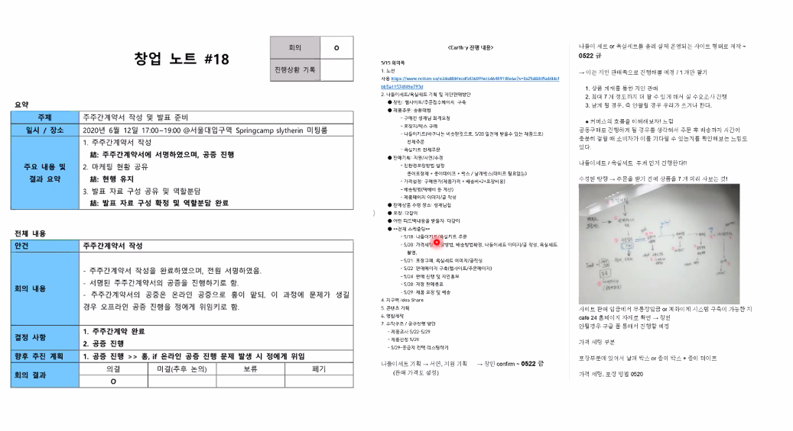

# 창업론 실습 1

## 첫수업

### 국내 창업기업 현황

중소벤처기업부 2019년 창업기업실태조사에 따르면 어찌되었건 창업기업의 숫자는 늘어 났고 이에 따라 매출액 추이가 늘어났다.

이보다 중요한 건 어떤 카테고리에 속하는 창업을 해야하는지이다.

위 표를 보면 기술 기반 창업이 늘어난 것을 확인해볼 수 있다. 자신이 개발한 인공지능 모델이나 특수한 공학적 기술을 이용한 창업이다.

따라서 이러한 기술 기반이 아닌 창업을 해야한다고 생각할 수도 있겠으나, 반드시 그렇지는 않다.

### 두 종류의 창업

| 중소기업 창업                                   | 혁신기업 창업                                                           |
| ----------------------------------------------- | ----------------------------------------------------------------------- |
| 지역시장                                        | 글로벌 시장                                                             |
| 혁신과 경쟁우위는 기업설립과 성장의 조건이 아님 | 혁신(기술, 프로세스, 비즈니스 모델)과 경쟁 우위는 사업 성공의 필수 조건 |
| 지역 내 일자리 창출                             | 지역적 제한이 없는 일자리 창출                                          |
| 가족기업, 외부자본 유입 필요 없음               | 다양한 지배구조, 외부자본 유입                                          |
| 선형적 성장                                     | 기하급수적 성장                                                         |

### 창업에 관심을 가지게 되는 경우

오랜기간 지치지 않고 즐기면서 잘할 수 있는 일은 무엇일까? 동력을 살펴보자.

| 아이디어                                                      | 기술                                                                         | 열정                                                                   |
| ------------------------------------------------------------- | ---------------------------------------------------------------------------- | ---------------------------------------------------------------------- |
| 창의적 발상, 기존 방식을 혁신할 창의적 아이템으로 사업화 주도 | 잠재력이 큰 신기술에 대한 지식. 기술상용화, 기술진보 가속화를 통한 사회 변화 | 의미있는 삶에 대한 열망, 자기 단련, 아이디어와 기술을 위해 파트너 물색 |

### 창업시 중요한 것들은?

창업의 3대 요소 : 사람, 아이디어, 자금  
창업 성공 요인

- Start with good people
- Make something customers actually want
- Spend as little money as possible

### 왜 실패하는가?

실패한 스타트업 101개 조사 결과,
테크스타트업 70%가 실패: 평균적으로 자금 조달 20개월 후 사망  
벤처 펀딩을 받은 기업의 20% ~ 30%가 실패  
한 가지 이유로만 실패하는 회사는 없다. 다양한 이유로 실패함.

### 지배력과 부의 추구가 팀 구성에 미치는 영향

| 구분      | 지배력 추구                 | 부 추구                |
| --------- | --------------------------- | ---------------------- |
| 1인 vs 팀 | 1인 창업                    | 공동 창업              |
| 관계      | 편안함, 주변 가까운 인물    | 최상의 공동창업자 모색 |
| 역할      | 계층적 의사 결정            | 공동 의사 결정         |
| 보상      | 창업자가 대부분의 지분 보유 | 지분 분배              |

### 목표 결과물

실습을 통해 검증된 BM을 포함한 IR자료 만들기

### 시제품 제작 150만원 지원 가능, 모바일 앱/웹 개발에 대해서는 지원 불가. 예창패 써보길 권장
