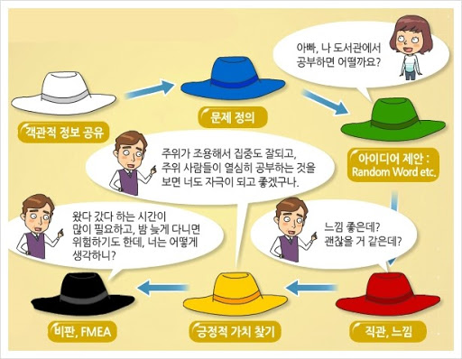
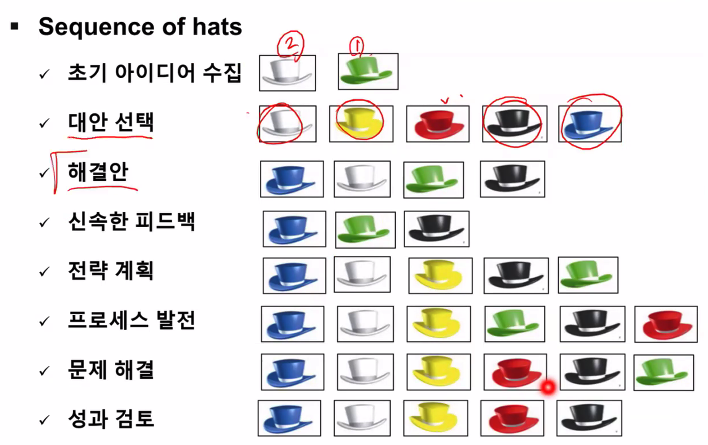

# 창조와 혁신

## 두번째 수업  

idea vs opportunity  

기회라는 것은 새로운 제품, 서비스 등 사업을 만들어내기 위한 호혜적인 상황  
즉 아이디어가 기회를 못 만날 때도 많다.  

기회 => 시기성, 해결 가능성, 필요성/가치, 수익성이 중요 팩터. + 환경(사업이 가능한 법적 토대 등)과 지속성이 부수적인 고려 요소들  

기회, 관심, 역량의 집합이 sweet spot  

## 사업적 기회 포착  

트렌드/동향 관찰이 필요. 유행을 좇는 아이템은 스타트업이 하기에는 기회 비용이 많다는 의견이 있음.

문제 인식 => 해결책 제공이 스타트업의 기본 접근법이다.  

**opportunity pull** : 문제를 인식하고 해결책을 찾는 것

**capability push** : 특정 기술, 역량이 되는데 이를 기반으로 해결할 문제를 찾는 것  

관찰 => 발견 => 가설화 및 구체화(비즈니스 아이템으로 구체화하는게 어렵다..)  

**가설의 형태** : x(타겟 고객)라는 사람이 y(pain point, 문제점)라는 문제가 있어서 z(솔루션)로 해결할 수 있다. 

### 아이디어 구체화 방법  
SCAMPER => ppt 그냥 참조해...

Substitute  
Combine  
Adapt  
Modify  
Put to another use  
Eliminate  
Reverse  

### six thinking hats  

이거 회의 할 때 좋겠다. 
각 모자로 상징되는 대화의 방향을 놓고 이야기하는 것

  
  

- 아이디어 생성의 경우  

하얀모자 > 파란모자 > 초록모자 > 노란모자 > 검은모자 > 빨간모자 순서로!

객관적 정보 => 문제 정의 => 아이디어 제안 (비판 금지) => 긍정적인 가치 찾기 => 비판하기 => 

- 아이디어 평가의 경우
빨간모자 > 노란모자 > 검은모자 > 초록모자 > 하얀모자 > 파란모자  
