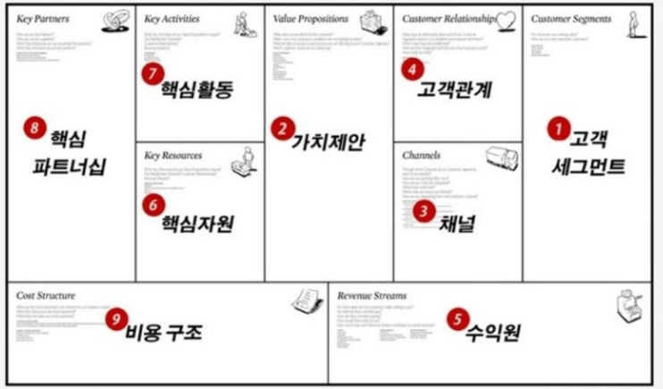

# 비즈니스 모델 캔버스

1. (고객 세그먼트) 사업은 PS이다. Problem을 먼저 발견하고, 해당 문제에 직면한 고객을 구체화하는 것으로부터 비즈니스 캔버스를 작성하기 시작한다.
2. (가치제안) 즉, '솔루션'을 말한다. 어떤 가치를 어떻게 전달할 것인가.
3. (채널) 이제 고객도 솔루션도 있다. 그렇다면 솔루션을 어떤 채널을 통해 고객에게 전달할 것인가? 앱? 웹? 오프라인?
4. (고객 관계) 한 번 고객을 물었으면 이를 유지하고, 새로운 유저는 들여와야 한다. 어떻게 리텐션을 높일 것인가?
5. (수익원) 그래서 어떻게 돈을 벌 것인가? 여기에는 가격 책정도 포함. 고객을 제대로 안다는 것은, 솔루션에 대한 가격을 매길 수 있음을 의미한다. 또, 자불 방법도 여기에 포함된다. 일회 결제? 구독?
6. (핵심 자원) 우리가 솔루션을 잘 만들기 위해서 우리가 가져야 하는 역량은 뭐가 있을까? 개발 능력, 기존의 인맥과 자본, 브랜드 파워, 공장 등.
7. (핵심 활동) 우리가 솔루션을 만들기 위해서 해야 하는 활동은 무엇일까? 플랫폼 홍보, 개발, 데브옵스 도입 등.
8. (핵심 파트너십) 투자자, 광고업체, 리소스 공급자 등. 우리가 모두 다 할 수는 없을테니까.
9. (비용 구조) 원가가 다가 아니다. 유통비용, 보관비용, 홍보비용, 인건비, 월세 등의 비용에 따른 현금흐름, 예상 수익과 비교하여 BEP는 언제 달성할 수 있을지 등.

## 5가지 BM  

Unbundling BM : 한 회사 안에 있는 서로 다른 타입의 사업을 분리 시킨 형태의 BM.  
그러니까, 통신사업조직의 경우에는 서로 다른 특성을 가진 사업이 동시에 존재하는 경우 많음. 
인프라 구축, 고객 영입, 컨텐츠 제공 이렇게 사업이 별도로 존재하고 각각 분리하는 케이스. 

Long Tail : 종류가 많고 상대적으로 수량이 적은 니치를 다 끌어오는 전략. 과거에는 대중적인 소수의 제품을 만들어내고 있지만 롱테일 BM은 다이소처럼 다양한 아이템을 모두 모아와 롱테일을 잡는 케이스.  

Freemium : 스카이프의 경우. 웹은 공짠데 모바일에서는 돈을 내야 함. 

bait & hook (coupling) : 프린터기와 토너 / 면도기와 면도날  

Open business model : 외부 파트너와의 협력을 통해 진입 장벽을 낮추는 비즈니스 모델. Connector. 이노센티브라는 전문 지식을 공유하는 회사가 있음.