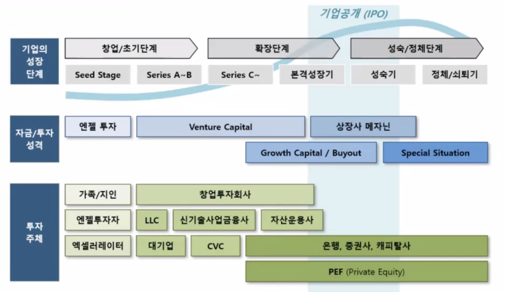

# 자금 조달 방안

정한빛, 더웰스인베스트먼트 강의

2018 벤처기업 정밀 실태 조사에 따르면,  
경영 애로 사항 1순위 = 돈. 자금조달, 운용 등 자금관리 (74.6%로 압도적)  
어떻게 투자 유치를 할 것인가?

대표는 cash flow를 살피고, 몇 달 후에 자금이 바닥날 것인지 예측하고, 그 안에 투자 유치를 하려고 노력해야 한다.  
시리즈 A 정도 받으려면 VC들과 최소 20~40분간은 이야기 하게 된다.

법인에게 자금 = 피, 자금의 흐름 = 혈액의 순환.

## 필요한 자금의 규모와 분야

창업 단계 => 초기 단계 => 확장 단계 => 성숙/정체 단계  
(seed => series A~B => series C~ => IPO)

창업 단계 : 최소한의 자본금은 스스로 마련. 특히 창업 초기 단계, MVP TEST 수행할 만큼의 자금.  
초기 단계 : 정부의 다양한 창업지원정책을 활용하며 버티기. 개발, 마케팅 사업 초기 활동 자금. 정부 자금 신청을 통해 자신의 사업의 사업성과 성장성 사전 점검하는 역할도 함. 정부 심사역도 VC임. VC한테 돈 받아도 되는데 사실 좋을 게 없음. 가급적 정부 자금으로 버텨보려고 해라.

엑셀러레이팅은 기수별로 모집하고, 지원해줌. 당연히 기수별로 네트워팅 기회 발생함. (해봐서 알잖아... 패스)  
창투사(VC)는 보통 성장 금융, 국민 연금 등 기관의 정책성 자금을 민간에 뿌리기 위한 펀드의 위탁 받아서 뿌림. 우리가 아는 벤쳐 캐피탈은 GP이다. 남의 돈을 가지고 운용하고 운용 보수 받으니까 ㅇㅇ

야. LLC 좀 이야기해볼까? 창투사 처럼 투자하는 행위 자체는 같다. 근본적으로 펀드를 크게 만들기 쉽지 않음. 한 기업에 투자하는 금액이 적을 수밖에 없음. 객관적인 사실임. 일반적인 스타트업은 자금이 항상 모자라기 때문에 투자 후에서 자잘하게 후속 투자, 지원을 받길 원하는데 LLC에는 그러지 못할 가능성이 좀 높음. 게다가 작년에 있었던 옵티머스 사건 때문에 자산 운용사들 힘들게 하고 있음 ㅋㅋ;

큰 기업의 자회사, CVC를 만들어서 별도의 펀드를 조성한 후 투자하는 경우도 있음. 이 경우는 돈을 받으면 다른 쪽의 채널이 막힐 가능성도 있음. 예를 들어 카카오벤쳐스한테 돈 받으면, 네이버한테 투자 받지 못할 가능성이 높음. 대기업의 계열사로부터 돈 받으면 VC, 창투사한테 돈을 못 받는다. 안 들어가려고 해. 이렇게 되면 외부 자금 조달이 힘들어지게 되는 거임.

그러나 이 이야기들은 먼 이야기들이고, 우선 시작한다면 지표를 만들어서 엑셀러레이터를 빠르게 만나보길 추천한다.

### 해외 투자에 대해. 한국에 있는 스타트업이라는 큰 이점을 포기하지 말 것.

한국에서 시작했지만 해외에서만 사업하는 사람들이 해외 VC로 부터 돈을 받지 않는 케이스가 있다.  
한국에서는 다른 나라와 비교하여 스타트업에게 지원해주는 것이 매우 많다.
한국의 스타트업이라는 점이 가지고 있는 이점이 매우 많다. 그래서 해외로 안 떠나는 경우도 많다.
심지어 해외인들로 구성되어 있는데 한국에 스타트업을 차리는 경우도 있다고 함.  
물론 쿠팡처럼 시작부터 미국에서 하는 경우도 있겠다만...

### 질문. 왜 기술 스타트업에만 투자함?

최근 1, 2년의 트렌드는 이번 정권의 색깔, 기조가 AI, blockchain, bio ... 기술 기반이다.  
이런 기술 기업에 투자하라고 펀드가 정부에서 레이징되는 경우가 많으니 VC도 그 자금을 기반으로 한 펀드를 운용하니 그럴 수밖에 없음.

비 기술 스타트업에 대한 투자는 이미 잘 이뤄지고 있음. 혹은, 갑자기 더 늘어나는 일은 없을거임.  
요새 많이 일어나는 투자가 기술 기반 스타트업에 대한 투자니 그렇게 보이기도 할 것. 기저효과.

### VC 자금의 특징

펀드는 만기가 있는 한시적인 투자자금임. 5~10년 정도. 물론 연장할 수는 있지만 거의 없는 케이스니 없다봐도 무방.  
펀드 만기가 되면 투자자에게 회수금을 돌려줘야 함.
평균 8년이라는 펀드의 만기를 고려했을 때 투자는 평균 2~3년하고 회수를 3~4년 해야 한다.  
이 말인 즉슨, 3~4년 내에 성과를 내고, 수익을 내야 한다. 우리 회사 3~4년 내에 뭘 이룰 것이다. 안정적으로 수익 돌려줄 것이다. 이런 식으로 설득해야 VC의 이해관계에 적합함.

이는 한국 특정임. 미국은 선배 창업가들의 돈임. 그런데 한국은 대개 국민 세금으로 조성된 국가 차원의 투자 자금임.  
이러한 펀드의 성격 때문에 저런 식으로 운용할수밖에 없음.

게다가 VC들도 펀드를 주는 국민연금, 사학연금, 군인공제회, 기존 은행 등에게 피칭을 해서 투자건을 따오는 거다. VC도 힘들다..

### 투자 절차

미팅 => 레퍼런스 체크, 상세 자료 => 투자 조건(Term Sheet) 논의 => 1차 투심위 => 투자 조건(Term Sheet) 확정 => 재무실사 => 2차 투심위 => 계약서 체결 => capital call => 투자금 납입 => 스타트업의 주주명부 등재

- Term Sheet은, 얼마를 투자할 것이고, 따라서 지분이 어느 정도 희석될 것이고...
- 재무 실사 비용은 돈 없다고 해라. VC에서 감당할 것이다... 솔직히 돈 없잖아 외부회계법인 데려오려면 그리고 투자 확정도 아닌데
- 투심위 통과하면 VC가 바로 쏘는게 아니라 VC도 계약서 올리고, 돈을 받아 와야 한다.

### VC의 투자 기준

좋은 회사라고 다 투자하지 않음.  
VC는 좋아질만한 회사에 투자해서 자금을 회수해야 한다. 결국 '성장성' = '투자 수익'을 본다는 것.
주식과 똑같다. 상승할만한 회사에 들어갔다가 피크 찍었을 때 자금 털고 나온다.

### 최근 VC 동향

언제 바뀔지는 모르지만. 초기기업 투자가 증가하는 중임. series A~B.  
그리고 지속 성장하는 유망기업에게 집중 투자. 부익부 빈익빈.  
1등이냐? 이게 문제임.

### 정부 창업 지원 자금

[중소벤처기업부 & 창업진흥원] 창업기업 지원포탈 www.k-startup.go.kr  
[중소벤처기업부 & 중소기업연구원] 기업마당 www.bizinfo.go.kr  
[창조경제혁신센터] https://ccei.creativekorea.or.kr/
