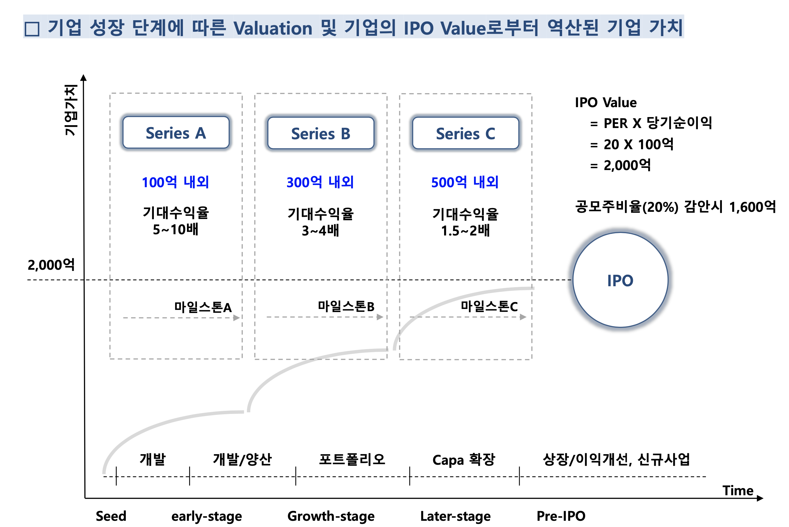

# 지분구조와 Valuation  

더웰스인베스트먼트 정한빛 이사.  (http://investwells.com/)  

## 매출과 밸류에이션은 따로 노는 것이다.  

직접 투자한 솔트룩스는 매출은 2배 뛰었는데 기업 가치는 9배 가량 뜀.  
엘앤씨바이오는 매출 2.5배 뛰었는데 기업가치는 6배 뜀.  
뭐지 이거? 밸류에이션이 매출과 관련있는 건 아는데 왜 따로 노는거지?  

## 주식의 종류 좀 알아보자.  

보통주 : 일반 주식. 의결권, 배당 있음.
우선주 : 배당 많이 주는데 의결권 없음. 회사가 돈 땡기려고 뿌리는 주식임.  
상환전환우선주 : 스타트업이 정식라운드로 투자받을 때 많이 발생하는 편임. 스타트업 초반에는 기관이라기보다는 앤젤이라던가, 개인적으로 받음. 회사 단계에 따라 발행하는 주식의 종류가 다름. 우선주인데 보통주로 전환될 수 있음. 상장시 보통주로 전환할 권리가 있음. 단, 전환할 때 1:1이 아니라 1:? 꼴로 refixing 조항이 보통 들어간다.
그리고 이 녀석은 부채의 성격을 가짐.  https://dbr.donga.com/article/view/1205/article_no/8089/ac/magazine

## 기업의 가치와 주식들.

상장기업은 시가 총액이 곧 기업 가치임. 총 주식수 x 주가.  
그런데 비상장 기업은? 총 주식수도 모르고, 주가도 모름.  

투자 전 기업가치  

▷ 가나다(주)는 자본금 900만원, 주식수 900주(주당 액면가 1만원)
▷ 투자자 A는 가나다(주)에 1,000만원을 투자 검토중
▷ 투자자 A는 기업가치를 9천만원으로 평가

▷ 1주당 가치?  
    - 9,000만원/900주 = 10만원 (액면가 1만원의 10배)  
▷ 투자자 A가 1,000만원 투자시 신규 발행 주식는?
    - 주식수 = 1,000만원/10만원 = 100주, 지분율 = 100주/1,000주 = 10%  
▷ 가나다(주)는 신주 100주 발행 & 투자자는 1,000만원 납입 & 주주명부 등재  
▷ 가나다(주)의 투자전 기업가치 = 900주 X 10만원/주 = 9,000만원  

실습문제)  
스파크플러스, 시리즈 B 300억원 투자 유치
▷ 투자 유치 전 자본금 45억원이라고 가정 (총 90만주)

Q1. 주식의 액면가는?  

Q2. 투자 전 기업가치 1,500억원이라고 하면, 금번 라운드에서 회사의 1주당 가치는 얼마로 산정한 것인가?  

Q3. Series B 투자유치 후 기업가치는? Series B 투자자들의 지분율의 합은?  

## 구체적으로 Valuation 산정 어떻게 합니까?  

비상장 기업의 경우 DCF 기법을 사용하지 않음.

스타트업이 진출한 섹터에 존재하는 회사가 얼마나 크더라, 그리고 얼마나 Valuation을 받더라는 것 정보를 일단 머릿속에 깔고 역산을 하여 밸류에이션을 판단함.  

  

단, 수학으로 명확히 떨어지지 않기 때문에 대표의 세치 혀로도 기업 가치가 널뛸 수 있다. 
때문에 VC는 회사의 정보를 매우 면밀하게 살피고, 기싸움을 한다.  

사업하는 사람 입장에서는, 일단 너무 정직하게 말고, 자신의 회사와 아이템을 예쁘게 꾸며서 살짝 허풍을 넣어야 한다.  
너무 말도 안되게 허풍은 치지 말고, 또 너무 정직하고 밸류에이션을 낮게 잡아 골목 장사할 것 같은 인상을 줘서도 안된다.   

## 아직 먼 이야기지만, IPO(상장) 이야기 해보자  

▷ 장점  
- 1 자금 조달 능력 증대 및 수단의 다양화 (공모, 유상증자, CB 발행 등)   
- 2 유동성 및 안정성 증대→경영 안정성 확대  
- 3 세제 상 혜택 (양도소득세, 배당소득세 등에서의 비과세/분리과세 등)  
- 4 기업의 공신력 제고 및 기업 홍보 효과  
  
▷ 단점  
- 1 기업 소유구조의 분산 → 경영권 위협 및 기업 비밀의 노출 가능성  
- 2 기업 공시 의무 (증권신고서, 투자설명회, 사업보고서, 반기/분기보고서 등)  
- 3 회계 감사의 의무 (공인된 외부로부터 회계 감사 필수. 회계 감사 비용 진짜 비싸.)  
- 4 상장과정에서의 시간과 비용 (주간사/지정감사인 선정, IFRS변환, 증권신고서 제출 등)  

## 그 밖의 투자 이야기들  

1. 지분을 사이좋게 나누지 말아라. 지분은 불공평하게 나눠야 한다.    
사내 벤쳐 같은 경우 5명이면 5명이 사이좋게 지분 나누고 있는데 이 같은 경우에는 난 투자 안함.  
VC가 매우 힘들어 하는 구조임. 책임 관계가 명확하지 않을 뿐더러, 스타트업은 언제든 망할 수 있어 신뢰하기에도 어려움.  
대표가 66.6% 이상은 들어고이써야 함.  
회사가 망할 경우에 요새 대다수의 스타트업들이 투자 계약에 **연대보증**을 거는데 **매우매우 위험한 짓이다.**  
계약서에서 가장 중요한 것은, 책임을 다 져야하지만, 책임과 의무를 다 쏟아 붓는 것은 피해야 한다. 님 인생을 위한 일임.  앤젤 투자, 개인 투자의 경우 투자 계약서가 독소조항이 있을 수 있음. 
시드투자 받더라도, 제대로 된 사람한테 받아라. 

2. 상장까지 얼마나 걸릴까?  
스타트업이 IPO까지 가는데 평균적으로 11년 정도 걸린다고. 

3. 돈 좀 받지마!  
MVP 개발할 때 조건부로 돈 주겠다는 기관이 있다면 좀 조심해라.  
그 레벨에서는 정부에서 주는 돈이나 앤젤, 사비, 3F에서 조달 받는게 더 건강하다.  
일단 남의 돈 받지 말고 끝까지 버티고 어떻게든 자생해보려고 노력해야 한다.  

4. Stock Vesting  
설립시 주주간 계약서에 Stock-Vesting 조항 존재. 
비상장 기업의 주식 가지고 있는 사람이 회사 나갈 경우 어떻게 해야 할지에 대한 이야기이다.  

- 근무기간 3년 이상 시 C 지분 유지 (주식을 아예 주겠다.)  
- 2~3년 내 퇴사시, C 지분의 50%를 대표 이사에게 액면가로 매도  
- 2년 내 퇴사시, C 지분의 100%를 대표 이사에게 액면가로 매도    